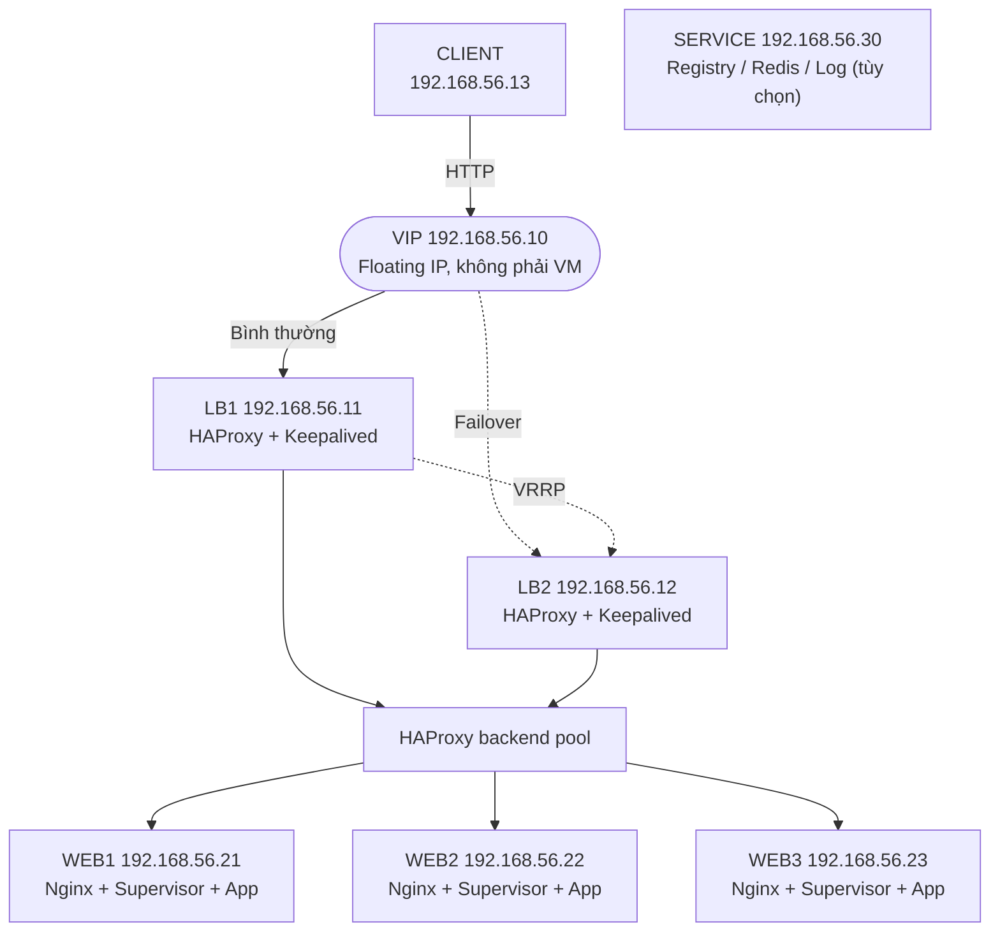

# Dự án lab: High Availability Web System với HAProxy, Keepalived, Nginx và Supervisor trên VirtualBox

## 1. Tổng quan dự án

Dự án này xây dựng một hệ thống web có tính sẵn sàng cao trên môi trường máy ảo VirtualBox. Hệ thống mô phỏng mô hình triển khai thực tế trên bộ 7 máy lab hiện có gồm 2 máy Load Balancer chạy HAProxy và Keepalived, 3 máy Web Server chạy Nginx, một ứng dụng mẫu được quản lý bằng Supervisor, 1 máy client/monitor và 1 máy service phụ có thể dùng làm registry/Redis/log host.

Mục tiêu chính của lab là giúp người học hiểu cách kết hợp các thành phần: 

- **HAProxy**: cân bằng tải request HTTP đến nhiều web server.
- **Keepalived**: tạo Virtual IP (VIP) và tự động failover giữa 2 load balancer.
- **Nginx**: reverse proxy/web server ở tầng ứng dụng.
- **Supervisor**: quản lý tiến trình ứng dụng mẫu, tự khởi động lại khi process bị lỗi.
- **VirtualBox**: mô phỏng hạ tầng nhiều server trên một máy cá nhân.

Sau khi hoàn thành, người dùng truy cập vào một địa chỉ VIP duy nhất. Nếu một web server chết, HAProxy tự loại khỏi pool. Nếu load balancer chính chết, Keepalived chuyển VIP sang load balancer dự phòng. Nếu ứng dụng trên web server bị dừng, Supervisor tự khởi động lại.

## 2. Mục tiêu học tập

Sau lab này, người học cần nắm được:

1. Cách thiết kế mô hình HA cho web application cơ bản.
2. Cách cấu hình HAProxy để cân bằng tải Layer 7.
3. Cách cấu hình Keepalived dùng VRRP để quản lý VIP.
4. Cách dùng Nginx làm reverse proxy cho ứng dụng nội bộ.
5. Cách dùng Supervisor để quản lý process ứng dụng.
6. Cách kiểm thử failover, health check và tự phục hồi dịch vụ.
7. Cách ghi nhận kết quả lab bằng log, ảnh chụp màn hình và bảng kiểm thử.

## 3. Kiến trúc đề xuất

### 3.1. Sơ đồ logic



Trong trạng thái bình thường, Keepalived gắn VIP `192.168.56.10` lên card Host-only của LB1. Khi LB1 hoặc HAProxy trên LB1 gặp lỗi, Keepalived trên LB2 nhận VIP `.10` và tiếp tục nhận request. VIP là địa chỉ nổi, không cần tạo thêm VM `.10`.

Minh chứng báo cáo:

- Ghi lại sơ đồ Mermaid ở mục này.
- Note ngắn: VIP `.10` là floating IP do Keepalived gắn lên LB đang MASTER, không phải một VM riêng.

### 3.2. Luồng request

1. Client truy cập `http://192.168.56.10`.
2. VIP đang nằm trên LB1 hoặc LB2 tùy trạng thái Keepalived.
3. HAProxy nhận request ở port 80.
4. HAProxy kiểm tra sức khỏe WEB1, WEB2 và WEB3.
5. Request được chuyển đến một web server còn khỏe.
6. Nginx trên web server nhận request.
7. Nginx reverse proxy request vào ứng dụng mẫu chạy local ở `127.0.0.1:9000`.
8. Ứng dụng trả response, Nginx trả về HAProxy, HAProxy trả về client.

## 4. Danh sách máy ảo

| VM | Vai trò | Hostname | IP host-only | Dịch vụ |
|---|---|---|---|---|
| LB1 | Load balancer chính | `lb1` | `192.168.56.11` | HAProxy, Keepalived |
| LB2 | Load balancer dự phòng | `lb2` | `192.168.56.12` | HAProxy, Keepalived |
| CLIENT | Client/monitor/dự phòng | `client1` | `192.168.56.13` | curl, ab/wrk, tcpdump, kiểm thử |
| WEB1 | Web server 1 | `web1` | `192.168.56.21` | Nginx, Supervisor, app |
| WEB2 | Web server 2 | `web2` | `192.168.56.22` | Nginx, Supervisor, app |
| WEB3 | Web server 3 | `web3` | `192.168.56.23` | Nginx, Supervisor, app |
| SERVICE | Service phụ | `service1` | `192.168.56.30` | Registry/Redis/log host tùy chọn |
| VIP | IP truy cập dịch vụ | N/A | `192.168.56.10` | Floating IP |

Minh chứng báo cáo:

- Ghi lại bảng vai trò, hostname và IP.
- Note rõ các IP dùng lại từ lab Swarm cũ, riêng VIP `.10` không được gán cố định cho VM nào.

Gợi ý cấu hình mỗi VM:

| Thành phần | Cấu hình tối thiểu |
|---|---|
| OS | Ubuntu Server 22.04 LTS hoặc 24.04 LTS |
| CPU | 1 vCPU |
| RAM | 1 GB |
| Disk | 10-20 GB |
| Network 1 | NAT để cài package từ Internet |
| Network 2 | Host-only Adapter `192.168.56.0/24` |

Lưu ý: VIP `192.168.56.10` phải nằm cùng subnet với LB1, LB2, WEB1, WEB2, WEB3, CLIENT, SERVICE và không được trùng IP với VM khác hoặc DHCP range của VirtualBox.

Nếu các máy này trước đó đang dùng cho lab Docker Swarm `fullstack-app`, có thể tắt tạm stack trước khi làm lab HA để tránh trùng port:

```bash
docker stack rm fullstack
```

Không cần xoá Swarm cluster. Lab HA này chạy trực tiếp bằng service Linux trên VM, không phụ thuộc Docker Swarm.

## 5. Phạm vi triển khai

### 5.1. Trong phạm vi

- Cấu hình IP tĩnh cho từng VM.
- Cài HAProxy trên LB1 và LB2.
- Cài Keepalived trên LB1 và LB2.
- Cài Nginx trên WEB1, WEB2 và WEB3.
- Cài Supervisor trên WEB1, WEB2 và WEB3.
- Tạo ứng dụng HTTP mẫu trả về hostname/IP để quan sát cân bằng tải.
- Kiểm thử failover load balancer.
- Kiểm thử health check web server.
- Kiểm thử Supervisor tự restart ứng dụng.

### 5.2. Ngoài phạm vi

- HTTPS/TLS production.
- Database cluster.
- CI/CD tự động.
- Monitoring nâng cao bằng Prometheus/Grafana.
- Hardening bảo mật đầy đủ cho môi trường production.

## 6. Chuẩn bị môi trường VirtualBox

### 6.1. Tạo Host-only Network

Trong VirtualBox:

1. Mở `File` -> `Tools` -> `Network Manager`.
2. Tạo hoặc chọn mạng Host-only.
3. Đặt subnet, ví dụ:

```text
IPv4 Address: 192.168.56.1
IPv4 Network Mask: 255.255.255.0
```

Có thể tắt DHCP để dễ quản lý IP tĩnh, hoặc giữ DHCP nhưng chọn IP tĩnh nằm ngoài DHCP range.

Minh chứng báo cáo:

- Chụp cấu hình Host-only Network trong VirtualBox, thấy subnet `192.168.56.0/24`.
- Note dải IP tĩnh dùng cho lab và khẳng định VIP `.10` không nằm trong DHCP range.

### 6.2. Gắn 2 card mạng cho mỗi VM

Mỗi VM nên có:

- Adapter 1: NAT.
- Adapter 2: Host-only Adapter.

NAT dùng để cài package. Host-only dùng để các VM và máy host giao tiếp với nhau.

Minh chứng báo cáo:

- Chụp phần Network của một VM mẫu, thấy Adapter 1 là NAT và Adapter 2 là Host-only Adapter.
- Không cần chụp đủ 7 VM nếu cấu hình giống nhau; có thể ghi chú “các VM còn lại cấu hình tương tự”.

## 7. Cấu hình IP tĩnh mẫu bằng Netplan

Ví dụ trên LB1, file `/etc/netplan/01-lab.yaml`:

```yaml
network:
  version: 2
  ethernets:
    enp0s3:
      dhcp4: true
    enp0s8:
      dhcp4: false
      addresses:
        - 192.168.56.11/24
```

Áp dụng cấu hình:

```bash
sudo netplan apply
ip a
ping -c 3 192.168.56.1
```

Thay IP tương ứng cho các máy:

```text
LB1  : 192.168.56.11/24
LB2  : 192.168.56.12/24
CLIENT : 192.168.56.13/24
WEB1 : 192.168.56.21/24
WEB2 : 192.168.56.22/24
WEB3 : 192.168.56.23/24
SERVICE : 192.168.56.30/24
VIP  : 192.168.56.10/24
```

Minh chứng báo cáo:

- Sau khi apply Netplan, chụp trên từng VM hoặc ảnh ghép output:

```bash
hostname
ip -br address
ping -c 3 192.168.56.1
```

- Note: IP Host-only của từng VM đúng với bảng ở mục 4; VIP `.10` chưa xuất hiện ở bước này vì Keepalived chưa chạy.

## 8. Cài đặt package

Trên LB1 và LB2:

```bash
sudo apt update
sudo apt install -y haproxy keepalived curl vim
```

Trên WEB1, WEB2 và WEB3:

```bash
sudo apt update
sudo apt install -y nginx supervisor python3 curl vim
```

Trên CLIENT `192.168.56.13` có thể cài thêm công cụ kiểm thử:

```bash
sudo apt update
sudo apt install -y curl apache2-utils tcpdump vim
```

Máy SERVICE `192.168.56.30` không bắt buộc trong luồng HA chính. Có thể giữ nguyên registry/Redis của lab Swarm cũ, hoặc dùng làm nơi nhận log/monitoring ở phần mở rộng.

Minh chứng báo cáo:

- Chụp hoặc ghi text phiên bản/trạng thái package chính sau khi cài:

```bash
haproxy -v
keepalived --version
nginx -v
supervisord --version
```

- Note máy nào cài nhóm package nào: LB cài HAProxy/Keepalived, WEB cài Nginx/Supervisor, CLIENT cài công cụ test.

## 9. Triển khai ứng dụng mẫu trên WEB1, WEB2 và WEB3

Tạo thư mục ứng dụng:

```bash
sudo mkdir -p /opt/lab-app
sudo vim /opt/lab-app/app.py
```

Nội dung `/opt/lab-app/app.py`:

```python
#!/usr/bin/env python3
from http.server import BaseHTTPRequestHandler, HTTPServer
import socket

class Handler(BaseHTTPRequestHandler):
    def do_GET(self):
        hostname = socket.gethostname()
        body = f"Hello from {hostname}\nPath: {self.path}\n"
        self.send_response(200)
        self.send_header("Content-Type", "text/plain")
        self.send_header("Content-Length", str(len(body.encode())))
        self.end_headers()
        self.wfile.write(body.encode())

server = HTTPServer(("127.0.0.1", 9000), Handler)
server.serve_forever()
```

Phân quyền:

```bash
sudo chmod +x /opt/lab-app/app.py
```

Minh chứng báo cáo:

- Ghi text nội dung file `/opt/lab-app/app.py` hoặc chụp đoạn code chính trả về hostname.
- Note app chạy local ở `127.0.0.1:9000`, Nginx sẽ reverse proxy vào port này.

## 10. Cấu hình Supervisor trên WEB1, WEB2 và WEB3

Tạo file `/etc/supervisor/conf.d/lab-app.conf`:

```ini
[program:lab-app]
command=/usr/bin/python3 /opt/lab-app/app.py
directory=/opt/lab-app
autostart=true
autorestart=true
startsecs=3
startretries=3
stderr_logfile=/var/log/lab-app.err.log
stdout_logfile=/var/log/lab-app.out.log
user=root
```

Reload Supervisor:

```bash
sudo supervisorctl reread
sudo supervisorctl update
sudo supervisorctl status
```

Kiểm tra ứng dụng:

```bash
curl http://127.0.0.1:9000
```

Minh chứng báo cáo:

- Chụp trên WEB1/WEB2/WEB3 output:

```bash
hostname
sudo supervisorctl status
curl http://127.0.0.1:9000
```

- Note trạng thái `lab-app` phải là `RUNNING` và response phải hiện đúng hostname của từng WEB.

## 11. Cấu hình Nginx trên WEB1, WEB2 và WEB3

Tạo file `/etc/nginx/sites-available/lab-app`:

```nginx
server {
    listen 80;
    server_name _;

    access_log /var/log/nginx/lab-app.access.log;
    error_log  /var/log/nginx/lab-app.error.log;

    location / {
        proxy_pass http://127.0.0.1:9000;
        proxy_http_version 1.1;
        proxy_set_header Host $host;
        proxy_set_header X-Real-IP $remote_addr;
        proxy_set_header X-Forwarded-For $proxy_add_x_forwarded_for;
        proxy_set_header X-Forwarded-Proto $scheme;
    }

    location /health {
        return 200 "ok\n";
        add_header Content-Type text/plain;
    }
}
```

Kích hoạt site:

```bash
sudo ln -s /etc/nginx/sites-available/lab-app /etc/nginx/sites-enabled/lab-app
sudo rm -f /etc/nginx/sites-enabled/default
sudo nginx -t
sudo systemctl reload nginx
```

Kiểm tra từ LB1 hoặc LB2:

```bash
curl http://192.168.56.21
curl http://192.168.56.22
curl http://192.168.56.23
curl http://192.168.56.21/health
curl http://192.168.56.22/health
curl http://192.168.56.23/health
```

Minh chứng báo cáo:

- Ghi text cấu hình Nginx gồm `proxy_pass http://127.0.0.1:9000` và location `/health`.
- Chụp output `sudo nginx -t` thành công và các lệnh `curl` từ LB1/LB2 tới WEB1/WEB2/WEB3.
- Note `/health` trả `ok` để HAProxy dùng làm health check.

## 12. Cấu hình HAProxy trên LB1 và LB2

Sao lưu file cấu hình cũ:

```bash
sudo cp /etc/haproxy/haproxy.cfg /etc/haproxy/haproxy.cfg.bak
sudo vim /etc/haproxy/haproxy.cfg
```

Nội dung cấu hình mẫu:

```haproxy
global
    log /dev/log local0
    log /dev/log local1 notice
    chroot /var/lib/haproxy
    stats socket /run/haproxy/admin.sock mode 660 level admin
    stats timeout 30s
    user haproxy
    group haproxy
    daemon

defaults
    log global
    mode http
    option httplog
    option dontlognull
    option forwardfor
    timeout connect 5s
    timeout client  50s
    timeout server  50s

frontend fe_web
    bind *:80
    default_backend be_web

backend be_web
    balance roundrobin
    option httpchk GET /health
    http-check expect status 200
    server web1 192.168.56.21:80 check inter 2s fall 2 rise 2
    server web2 192.168.56.22:80 check inter 2s fall 2 rise 2
    server web3 192.168.56.23:80 check inter 2s fall 2 rise 2

listen stats
    bind *:8404
    stats enable
    stats uri /stats
    stats refresh 5s
    stats auth admin:admin123
```

Kiểm tra và restart:

```bash
sudo haproxy -c -f /etc/haproxy/haproxy.cfg
sudo systemctl restart haproxy
sudo systemctl enable haproxy
```

Kiểm tra trực tiếp từng load balancer:

```bash
curl http://192.168.56.11
curl http://192.168.56.12
```

Trang thống kê HAProxy:

```text
http://192.168.56.11:8404/stats
http://192.168.56.12:8404/stats
Username: admin
Password: admin123
```

Minh chứng báo cáo:

- Ghi text cấu hình HAProxy gồm `frontend fe_web`, `bind *:80`, `backend be_web`, `option httpchk GET /health` và ba dòng `server web1/web2/web3`.
- Chụp output `sudo haproxy -c -f /etc/haproxy/haproxy.cfg` báo cấu hình hợp lệ.
- Chụp trang stats `http://192.168.56.11:8404/stats` hoặc `http://192.168.56.12:8404/stats`, thấy WEB1/WEB2/WEB3 ở trạng thái `UP`.

## 13. Cấu hình Keepalived

### 13.1. Script kiểm tra HAProxy

Tạo file `/etc/keepalived/check_haproxy.sh` trên cả LB1 và LB2:

```bash
#!/usr/bin/env bash
pidof haproxy >/dev/null 2>&1
```

Phân quyền:

```bash
sudo chmod +x /etc/keepalived/check_haproxy.sh
```

### 13.2. Cấu hình Keepalived trên LB1

File `/etc/keepalived/keepalived.conf`:

```conf
global_defs {
    router_id LB1
}

vrrp_script chk_haproxy {
    script "/etc/keepalived/check_haproxy.sh"
    interval 2
    fall 2
    rise 2
    weight -30
}

vrrp_instance VI_1 {
    state MASTER
    interface enp0s8
    virtual_router_id 51
    priority 150
    advert_int 1

    authentication {
        auth_type PASS
        auth_pass labpass
    }

    virtual_ipaddress {
        192.168.56.10/24
    }

    track_script {
        chk_haproxy
    }
}
```

### 13.3. Cấu hình Keepalived trên LB2

File `/etc/keepalived/keepalived.conf`:

```conf
global_defs {
    router_id LB2
}

vrrp_script chk_haproxy {
    script "/etc/keepalived/check_haproxy.sh"
    interval 2
    fall 2
    rise 2
    weight -30
}

vrrp_instance VI_1 {
    state BACKUP
    interface enp0s8
    virtual_router_id 51
    priority 100
    advert_int 1

    authentication {
        auth_type PASS
        auth_pass labpass
    }

    virtual_ipaddress {
        192.168.56.10/24
    }

    track_script {
        chk_haproxy
    }
}
```

Lưu ý:

- `interface enp0s8` cần đúng với tên card Host-only trên VM.
- `virtual_router_id` phải giống nhau giữa LB1 và LB2.
- `priority` của LB1 cao hơn LB2 để LB1 làm MASTER mặc định.
- `auth_pass` nên đổi nếu dùng trong môi trường thật.

Khởi động Keepalived:

```bash
sudo systemctl restart keepalived
sudo systemctl enable keepalived
sudo systemctl status keepalived
```

Kiểm tra VIP đang ở máy nào:

```bash
ip a | grep 192.168.56.10
```

Minh chứng báo cáo:

- Ghi text hai file `/etc/keepalived/keepalived.conf` của LB1 và LB2, nhấn mạnh `state`, `priority`, `virtual_router_id`, interface và VIP `.10`.
- Chụp trên cả LB1 và LB2:

```bash
hostname
sudo systemctl --no-pager status keepalived
ip -br address | grep -E 'enp0s8|192.168.56.10'
```

- Note trạng thái bình thường: VIP `.10` nằm trên LB1 vì LB1 có priority cao hơn.

## 14. Kiểm thử chức năng

### 14.1. Kiểm thử truy cập qua VIP

Từ máy host hoặc VM CLIENT `192.168.56.13`:

```bash
curl http://192.168.56.10
```

Chạy nhiều lần:

```bash
for i in {1..10}; do curl -s http://192.168.56.10; done
```

Kết quả kỳ vọng:

- Response luân phiên giữa `web1`, `web2` và `web3`.
- HAProxy stats hiển thị cả 3 backend ở trạng thái UP.

Minh chứng báo cáo:

- Chụp từ CLIENT output vòng lặp `curl`, thấy response lần lượt từ `web1`, `web2`, `web3`.
- Chụp HAProxy stats lúc cả ba backend đều `UP`.
- Note đây là bằng chứng HAProxy đang cân bằng tải qua VIP `.10`.

### 14.2. Kiểm thử WEB1 bị lỗi

Trên WEB1:

```bash
sudo systemctl stop nginx
```

Trên client:

```bash
for i in {1..10}; do curl -s http://192.168.56.10; done
```

Kết quả kỳ vọng:

- Request vẫn thành công.
- Response còn lại luân phiên giữa `web2` và `web3`.
- HAProxy stats hiển thị `web1` DOWN.

Minh chứng báo cáo:

- Chụp trên WEB1 lệnh `sudo systemctl stop nginx`.
- Chụp từ CLIENT vòng lặp `curl` vẫn có response từ `web2` và `web3`.
- Chụp HAProxy stats thấy `web1` `DOWN`, `web2`/`web3` `UP`.
- Sau khi khôi phục, chụp lại stats thấy `web1` quay về `UP`.

Khôi phục:

```bash
sudo systemctl start nginx
```

### 14.3. Kiểm thử mất 2 web server

Trên WEB1 và WEB2:

```bash
sudo systemctl stop nginx
```

Trên client:

```bash
for i in {1..10}; do curl -s http://192.168.56.10; done
```

Kết quả kỳ vọng:

- Request vẫn thành công nếu WEB3 còn sống.
- Toàn bộ response đến từ `web3`.
- HAProxy stats hiển thị `web1` và `web2` DOWN, `web3` UP.

Minh chứng báo cáo:

- Chụp thao tác dừng Nginx trên WEB1 và WEB2.
- Chụp CLIENT vẫn truy cập được VIP và chỉ nhận response từ `web3`.
- Chụp stats thấy `web1`, `web2` `DOWN` và `web3` `UP`.

Khôi phục:

```bash
sudo systemctl start nginx
```

### 14.4. Kiểm thử Supervisor tự restart app

Trên WEB1:

```bash
sudo supervisorctl status
sudo pkill -f "/opt/lab-app/app.py"
sleep 5
sudo supervisorctl status
curl http://127.0.0.1:9000
```

Kết quả kỳ vọng:

- Process `lab-app` được Supervisor tự khởi động lại.
- Nginx tiếp tục proxy được vào app.

Minh chứng báo cáo:

- Chụp `sudo supervisorctl status` trước khi kill app.
- Chụp lệnh `sudo pkill -f "/opt/lab-app/app.py"` và trạng thái `RUNNING` sau vài giây.
- Chụp `curl http://127.0.0.1:9000` vẫn trả response.
- Note Supervisor tự phục hồi process app, không phải restart thủ công.

### 14.5. Kiểm thử failover LB1 sang LB2

Trên LB1:

```bash
sudo systemctl stop keepalived
```

Trên LB2:

```bash
ip a | grep 192.168.56.10
```

Trên client:

```bash
curl http://192.168.56.10
```

Kết quả kỳ vọng:

- VIP chuyển sang LB2.
- Client vẫn truy cập được dịch vụ qua `192.168.56.10`.

Minh chứng báo cáo:

- Chụp trên LB1 lệnh `sudo systemctl stop keepalived`.
- Chụp trên LB2 output `ip a | grep 192.168.56.10`, thấy VIP xuất hiện.
- Chụp từ CLIENT `curl http://192.168.56.10` vẫn thành công.
- Nếu có thể, chụp terminal CLIENT chạy curl liên tục trong lúc failover để thấy gián đoạn rất ngắn hoặc không đáng kể.

Khôi phục LB1:

```bash
sudo systemctl start keepalived
```

Tùy cấu hình priority, VIP có thể chuyển lại LB1.

### 14.6. Kiểm thử HAProxy chết trên LB1

Trên LB1:

```bash
sudo systemctl stop haproxy
```

Kết quả kỳ vọng:

- Script `chk_haproxy` làm giảm priority của LB1.
- Keepalived chuyển VIP sang LB2 nếu LB1 không còn đủ điều kiện làm MASTER.
- Client vẫn truy cập được qua VIP.

Minh chứng báo cáo:

- Chụp trên LB1 lệnh `sudo systemctl stop haproxy`.
- Chụp log hoặc trạng thái Keepalived cho thấy VIP chuyển sang LB2.
- Chụp CLIENT truy cập VIP thành công sau khi HAProxy trên LB1 bị dừng.
- Sau khi khôi phục, chụp `sudo systemctl start haproxy` và trạng thái backend/VIP trở lại bình thường.

Khôi phục:

```bash
sudo systemctl start haproxy
```

## 15. Bảng nghiệm thu

| Mã kiểm thử | Nội dung | Cách kiểm tra | Kết quả kỳ vọng | Trạng thái |
|---|---|---|---|---|
| TC01 | Truy cập VIP | `curl http://192.168.56.10` | Có response HTTP 200 | Chưa test |
| TC02 | Cân bằng tải | Curl nhiều lần | Response luân phiên WEB1/WEB2/WEB3 | Chưa test |
| TC03 | WEB1 down | Stop Nginx WEB1 | Traffic chuyển sang WEB2/WEB3 | Chưa test |
| TC04 | WEB2 down | Stop Nginx WEB2 | Traffic chuyển sang WEB1/WEB3 | Chưa test |
| TC05 | WEB3 down | Stop Nginx WEB3 | Traffic chuyển sang WEB1/WEB2 | Chưa test |
| TC06 | WEB1 + WEB2 down | Stop Nginx WEB1 và WEB2 | Traffic vẫn chạy qua WEB3 | Chưa test |
| TC07 | App bị kill | `pkill` app | Supervisor restart app | Chưa test |
| TC08 | LB1 down | Stop Keepalived hoặc tắt VM LB1 | VIP chuyển sang LB2 | Chưa test |
| TC09 | HAProxy LB1 lỗi | Stop HAProxy LB1 | VIP chuyển sang LB2 | Chưa test |
| TC10 | Khôi phục node | Start lại dịch vụ | Node quay lại trạng thái UP | Chưa test |

## 16. Các lỗi thường gặp

### 16.1. Không ping được giữa các VM

Nguyên nhân có thể:

- Chưa gắn Host-only Adapter.
- IP không cùng subnet.
- Netplan cấu hình sai tên interface.
- Firewall chặn ICMP hoặc HTTP.

Kiểm tra:

```bash
ip a
ip route
ping 192.168.56.11
ping 192.168.56.21
```

### 16.2. VIP không xuất hiện

Kiểm tra:

```bash
sudo systemctl status keepalived
sudo journalctl -u keepalived -f
ip a
```

Nguyên nhân thường gặp:

- Sai tên interface trong `keepalived.conf`.
- Trùng `virtual_router_id` với lab khác trong cùng mạng.
- VIP bị trùng với IP của máy khác.
- Keepalived chưa được restart sau khi đổi cấu hình.

### 16.3. HAProxy báo backend DOWN

Kiểm tra từ LB:

```bash
curl -v http://192.168.56.21/health
curl -v http://192.168.56.22/health
curl -v http://192.168.56.23/health
sudo journalctl -u haproxy -f
```

Nguyên nhân thường gặp:

- Nginx chưa chạy.
- Sai IP backend trong `haproxy.cfg`.
- Endpoint `/health` không trả HTTP 200.
- Firewall chặn port 80.

### 16.4. Nginx trả 502 Bad Gateway

Kiểm tra trên WEB:

```bash
sudo supervisorctl status
curl http://127.0.0.1:9000
sudo tail -f /var/log/nginx/lab-app.error.log
```

Nguyên nhân thường gặp:

- App chưa chạy.
- Supervisor chưa load config.
- App không listen ở `127.0.0.1:9000`.
- Sai `proxy_pass` trong Nginx.

## 17. Mở rộng lab

Sau khi lab cơ bản chạy ổn, có thể mở rộng:

1. Bật sticky session bằng cookie trong HAProxy.
2. Thêm HTTPS termination tại HAProxy khi cần mở rộng lab.
3. Thêm rate limiting bằng HAProxy hoặc Nginx.
4. Gửi log HAProxy/Nginx về máy SERVICE `192.168.56.30`.
5. Thêm Prometheus Node Exporter để giám sát VM.
6. Dùng CLIENT `192.168.56.13` để chạy `ab`, `wrk`, `tcpdump` hoặc script curl liên tục.
7. Viết Ansible playbook để tự động hóa toàn bộ lab.
8. Đổi app mẫu Python thành Node.js, Flask hoặc Laravel.

## 18. Minh chứng cần thu thập cho báo cáo

### 18.1. Quy tắc ghi nhận

- **Ảnh chụp** dùng để chứng minh trạng thái hoặc kết quả chạy thực tế. Ảnh nên thấy hostname, lệnh đã chạy và output liên quan.
- **Text/code** dùng cho sơ đồ, bảng IP và các file cấu hình. Không nên chụp ảnh toàn bộ file cấu hình vì khó đọc và khó đối chiếu.
- Mỗi ảnh cần có số thứ tự, chú thích ngắn và kết luận một câu ngay bên dưới.
- Với bài kiểm thử lỗi, cần ghi đủ ba trạng thái: trước khi gây lỗi, khi đang lỗi và sau khi khôi phục.
- Không đưa mật khẩu thật, token hoặc secret vào ảnh và nội dung báo cáo.

### 18.2. Danh sách minh chứng

| Mã | Mức độ | Nội dung cần ghi nhận | Dạng | Lệnh hoặc nội dung cần thấy |
|---|---|---|---|---|
| BC01 | Bắt buộc | Sơ đồ kiến trúc 7 máy và VIP | Text/Mermaid | CLIENT `.13`, LB `.11/.12`, WEB `.21/.22/.23`, SERVICE `.30`, VIP `.10` |
| BC02 | Bắt buộc | Bảng vai trò, hostname và IP | Text | Bảng ở mục 4; ghi rõ VIP không phải VM |
| BC03 | Bắt buộc | IP Host-only trên các VM | Ảnh | `hostname; ip -br address` trên từng VM hoặc ảnh ghép có nhãn rõ ràng |
| BC04 | Bắt buộc | Cấu hình HAProxy | Text/code | `frontend`, `bind *:80`, `backend`, health check và ba dòng `server web1/web2/web3` |
| BC05 | Bắt buộc | Cấu hình Keepalived của hai LB | Text/code | Interface, VRID, priority, VIP `.10` và `track_script` |
| BC06 | Bắt buộc | Cấu hình Nginx và Supervisor | Text/code | `proxy_pass 127.0.0.1:9000`, `/health`, lệnh chạy app và `autorestart=true` |
| BC07 | Bắt buộc | Trạng thái dịch vụ ban đầu | Ảnh | `systemctl --no-pager status haproxy keepalived` trên LB; `systemctl --no-pager status nginx supervisor` trên WEB |
| BC08 | Bắt buộc | VIP đang thuộc LB1 lúc bình thường | Ảnh | `hostname; ip -br address | grep 192.168.56.10` trên LB1; LB2 không có VIP |
| BC09 | Bắt buộc | Truy cập và cân bằng tải qua VIP | Ảnh | Vòng lặp `curl` HTTP trả lần lượt `web1`, `web2`, `web3` |
| BC10 | Khuyến nghị | Ba backend khỏe trên HAProxy | Ảnh | Trang `http://192.168.56.11:8404/stats` hiển thị WEB1, WEB2, WEB3 ở trạng thái UP |
| BC11 | Bắt buộc | Một web server bị lỗi | Ảnh | WEB1 dừng Nginx; client vẫn nhận response từ WEB2/WEB3; stats hiển thị WEB1 DOWN |
| BC12 | Bắt buộc | Supervisor tự phục hồi app | Ảnh | Trạng thái process trước khi kill và trạng thái RUNNING sau khi Supervisor restart |
| BC13 | Bắt buộc | Failover từ LB1 sang LB2 | Ảnh | LB1 dừng Keepalived; VIP `.10` xuất hiện trên LB2; client vẫn curl thành công |
| BC14 | Khuyến nghị | Client không bị gián đoạn đáng kể khi failover | Ảnh/text | Output curl liên tục có timestamp trong lúc chuyển VIP |
| BC15 | Bắt buộc | Khôi phục hệ thống | Ảnh | Dịch vụ được start lại, backend trở về UP và VIP nằm trên LB có priority cao hơn |
| BC16 | Bắt buộc | Kết quả nghiệm thu | Text | Điền trạng thái thực tế và ghi chú cho TC01-TC10 ở mục 15 |

### 18.3. Lệnh hỗ trợ lấy minh chứng

Ghi hostname và địa chỉ IP của máy đang thao tác:

```bash
date
hostname
ip -br address
```

Chụp kết quả cân bằng tải từ CLIENT:

```bash
for i in {1..12}; do curl -s http://192.168.56.10 | head -n 1; done
```

Theo dõi request trong lúc kiểm thử failover:

```bash
while true; do
    printf '%s - ' "$(date '+%H:%M:%S')"
    curl -s --max-time 2 http://192.168.56.10 | head -n 1 || echo "request failed"
    sleep 1
done
```

Kiểm tra VIP trên cả hai LB trước và sau failover:

```bash
hostname
ip -br address | grep -E 'enp0s8|192.168.56.10'
```

Khi chụp ảnh failover, nên mở ba cửa sổ terminal cùng lúc: CLIENT chạy curl liên tục, LB1 thực hiện dừng dịch vụ và LB2 theo dõi VIP `.10` xuất hiện.

## 19. Sản phẩm bàn giao

Khi hoàn thành dự án, cần có:

- File mô tả kiến trúc hệ thống.
- Ảnh chụp sơ đồ VirtualBox network.
- Ảnh chụp danh sách VM và IP.
- File cấu hình HAProxy trên LB1/LB2.
- File cấu hình Keepalived trên LB1/LB2.
- File cấu hình Nginx trên WEB1/WEB2/WEB3.
- File cấu hình Supervisor trên WEB1/WEB2/WEB3.
- Ảnh hoặc log chứng minh truy cập VIP thành công.
- Ảnh hoặc log chứng minh failover LB thành công.
- Ảnh hoặc log chứng minh backend health check hoạt động.
- Bảng nghiệm thu đã điền kết quả thực tế.

## 20. Kết luận

Lab này mô phỏng một kiến trúc web có tính sẵn sàng cao ở mức cơ bản nhưng sát với thực tế triển khai. HAProxy xử lý cân bằng tải, Keepalived xử lý failover cho tầng load balancer, Nginx làm web/reverse proxy ở tầng ứng dụng, và Supervisor đảm bảo process ứng dụng tự phục hồi khi gặp lỗi.

Điểm quan trọng nhất của bài lab không chỉ là cài được từng công cụ riêng lẻ, mà là hiểu được cách chúng phối hợp với nhau để giảm Single Point of Failure và giữ dịch vụ tiếp tục hoạt động khi một thành phần bị lỗi.

## 21. Bài lab bổ sung: Nginx và Supervisor trong Docker Compose

Mục này bổ sung ngắn gọn để đáp ứng đúng yêu cầu demo: Nginx có log, port listen, certificate path, allow method, add header, expose file/directory; triển khai bằng Docker Compose; Supervisor có add/remove service, log path và multi worker.

### 21.1. Chuẩn bị thư mục

```bash
mkdir -p nginx-supervisor-lab/{app,certs,logs/nginx,logs/supervisor,nginx,public/downloads,supervisor/conf.d}
cd nginx-supervisor-lab
printf 'Hello from Nginx file\n' > public/hello.txt
printf 'Download demo file\n' > public/downloads/demo.txt
```

Tạo certificate tự ký cho HTTPS:

```bash
openssl req -x509 -nodes -newkey rsa:2048 -days 365 \
  -keyout certs/lab.key \
  -out certs/lab.crt \
  -subj "/C=VN/ST=HCM/L=HCM/O=VCS-Lab/CN=lab.local"
```

### 21.2. App demo multi worker

Tạo file `app/app.py`:

```python
#!/usr/bin/env python3
import argparse
import json
import os
from http.server import BaseHTTPRequestHandler, ThreadingHTTPServer

class Handler(BaseHTTPRequestHandler):
    def do_GET(self):
        body = json.dumps({
            "worker": os.environ.get("WORKER_NAME"),
            "port": self.server.server_port,
            "path": self.path,
        }).encode()
        self.send_response(200)
        self.send_header("Content-Type", "application/json")
        self.send_header("Content-Length", str(len(body)))
        self.end_headers()
        self.wfile.write(body)

parser = argparse.ArgumentParser()
parser.add_argument("--port", type=int, required=True)
args = parser.parse_args()
ThreadingHTTPServer(("127.0.0.1", args.port), Handler).serve_forever()
```

### 21.3. Cấu hình Nginx

Tạo file `nginx/nginx.conf`:

```nginx
user www-data;
worker_processes auto;
pid /run/nginx.pid;
error_log /var/log/nginx/error.log warn;

events {
    worker_connections 1024;
}

http {
    include /etc/nginx/mime.types;
    default_type application/octet-stream;

    log_format lab '$remote_addr [$time_local] "$request" $status upstream=$upstream_addr';
    access_log /var/log/nginx/access.log lab;

    upstream app_workers {
        least_conn;
        server 127.0.0.1:9000;
        server 127.0.0.1:9001;
    }

    server {
        listen 8080;
        server_name _;

        add_header X-Lab-Stack "nginx-supervisor-compose" always;
        add_header X-Content-Type-Options "nosniff" always;

        location = /health {
            return 200 "ok\n";
        }

        location /api/ {
            limit_except GET HEAD {
                deny all;
            }
            proxy_pass http://app_workers;
            proxy_set_header Host $host;
            proxy_set_header X-Real-IP $remote_addr;
            proxy_set_header X-Forwarded-For $proxy_add_x_forwarded_for;
            proxy_set_header X-Forwarded-Proto $scheme;
        }

        location = /hello.txt {
            alias /srv/public/hello.txt;
        }

        location /downloads/ {
            alias /srv/public/downloads/;
            autoindex on;
        }
    }

    server {
        listen 8443 ssl;
        server_name _;

        ssl_certificate /etc/nginx/certs/lab.crt;
        ssl_certificate_key /etc/nginx/certs/lab.key;
        ssl_protocols TLSv1.2 TLSv1.3;

        add_header X-Lab-Stack "nginx-supervisor-compose" always;

        location / {
            limit_except GET HEAD {
                deny all;
            }
            proxy_pass http://app_workers;
        }
    }
}
```
  
Các yêu cầu Nginx được thể hiện trực tiếp trong file trên:

| Yêu cầu | Dòng cấu hình cần demo |
|---|---|
| File log | `error_log`, `access_log` |
| Port listen | `listen 8080`, `listen 8443 ssl` |
| Cert path | `ssl_certificate`, `ssl_certificate_key` |
| Allow method | `limit_except GET HEAD` |
| Add header | `add_header X-Lab-Stack ... always` |
| Expose file | `location = /hello.txt` |
| Expose directory | `location /downloads/`, `autoindex on` |

### 21.4. Cấu hình Supervisor

Tạo file `supervisor/supervisord.conf`:

```ini
[unix_http_server]
file=/run/supervisor.sock
chmod=0700

[supervisord]
nodaemon=true
logfile=/var/log/supervisor/supervisord.log
pidfile=/run/supervisord.pid
childlogdir=/var/log/supervisor

[rpcinterface:supervisor]
supervisor.rpcinterface_factory=supervisor.rpcinterface:make_main_rpcinterface

[supervisorctl]
serverurl=unix:///run/supervisor.sock

[include]
files=/etc/supervisor/conf.d/*.conf
```

Tạo file `supervisor/conf.d/nginx.conf`:

```ini
[program:nginx]
command=/usr/sbin/nginx -g "daemon off;" -c /etc/nginx/nginx.conf
autostart=true
autorestart=true
stdout_logfile=/var/log/supervisor/nginx.stdout.log
stderr_logfile=/var/log/supervisor/nginx.stderr.log
```

Tạo file `supervisor/conf.d/app-workers.conf`:

```ini
[program:app]
command=/usr/bin/python3 /opt/lab-app/app.py --port 900%(process_num)d
process_name=%(program_name)s_%(process_num)02d
numprocs=2
numprocs_start=0
environment=PYTHONUNBUFFERED="1",WORKER_NAME="%(program_name)s_%(process_num)02d"
autostart=true
autorestart=true
stdout_logfile=/var/log/supervisor/%(program_name)s_%(process_num)02d.stdout.log
stderr_logfile=/var/log/supervisor/%(program_name)s_%(process_num)02d.stderr.log
```

`numprocs=2` tạo hai worker `app_00` và `app_01`, tương ứng port `9000` và `9001`. Các log Supervisor được ghi vào `/var/log/supervisor`.

Tạo service mẫu để demo add/remove, đặt ở trạng thái chưa nạp bằng đuôi `.disabled`: `supervisor/conf.d/demo-clock.conf.disabled`.

```ini
[program:demo-clock]
command=/bin/sh -c 'while true; do date -Iseconds; sleep 5; done'
autostart=true
autorestart=true
stdout_logfile=/var/log/supervisor/demo-clock.stdout.log
stderr_logfile=/var/log/supervisor/demo-clock.stderr.log
```

### 21.5. Docker Compose

Tạo file `Dockerfile`:

```dockerfile
FROM ubuntu:24.04

ENV DEBIAN_FRONTEND=noninteractive

RUN apt-get update \
    && apt-get install -y --no-install-recommends nginx supervisor python3 curl ca-certificates \
    && rm -rf /var/lib/apt/lists/* \
    && mkdir -p /run /var/log/nginx /var/log/supervisor

EXPOSE 8080 8443
CMD ["/usr/bin/supervisord", "-n", "-c", "/etc/supervisor/supervisord.conf"]
```

Tạo file `compose.yaml`:

```yaml
services:
  web:
    build: .
    container_name: nginx-supervisor-lab
    ports:
      - "8088:8080"
      - "8443:8443"
    volumes:
      - ./app:/opt/lab-app:ro
      - ./nginx/nginx.conf:/etc/nginx/nginx.conf:ro
      - ./supervisor/supervisord.conf:/etc/supervisor/supervisord.conf:ro
      - ./supervisor/conf.d:/etc/supervisor/conf.d
      - ./public:/srv/public:ro
      - ./certs:/etc/nginx/certs:ro
      - ./logs/nginx:/var/log/nginx
      - ./logs/supervisor:/var/log/supervisor
```

Chạy lab:

```bash
docker compose build
docker compose up -d
docker compose ps
```

### 21.6. Lệnh demo nghiệm thu

Kiểm tra Nginx và các dòng cấu hình chính:

```bash
docker compose exec web nginx -t
docker compose exec web grep -nE "listen|access_log|error_log|ssl_certificate|limit_except|add_header|alias|autoindex" /etc/nginx/nginx.conf
```

Kiểm tra port, header, method, file, directory và HTTPS:

```bash
curl -i http://127.0.0.1:8088/health
curl -i http://127.0.0.1:8088/api/
curl -i -X POST http://127.0.0.1:8088/api/
curl -i http://127.0.0.1:8088/hello.txt
curl -i http://127.0.0.1:8088/downloads/
curl -ki https://127.0.0.1:8443/
```

Kết quả cần có: `/health` trả `200`, response có header `X-Lab-Stack`, `POST /api/` bị chặn `403`, `/hello.txt` trả nội dung file, `/downloads/` hiện danh sách file, HTTPS dùng certificate trong `/etc/nginx/certs`.

Kiểm tra log path:

```bash
ls -lh logs/nginx logs/supervisor
tail -n 5 logs/nginx/access.log
tail -n 5 logs/supervisor/supervisord.log
```

Kiểm tra Supervisor và multi worker:

```bash
docker compose exec web supervisorctl status
for i in {1..10}; do curl -s http://127.0.0.1:8088/api/; echo; done
```

Kết quả cần thấy `nginx`, `app:app_00`, `app:app_01` đều `RUNNING`; output curl xuất hiện cả `app_00` và `app_01`.

Demo add service:

```bash
mv supervisor/conf.d/demo-clock.conf.disabled supervisor/conf.d/demo-clock.conf
docker compose exec web supervisorctl reread
docker compose exec web supervisorctl update
docker compose exec web supervisorctl status
```

Demo remove service:

```bash
docker compose exec web supervisorctl stop demo-clock
mv supervisor/conf.d/demo-clock.conf supervisor/conf.d/demo-clock.conf.disabled
docker compose exec web supervisorctl reread
docker compose exec web supervisorctl update
docker compose exec web supervisorctl status
```

Sau khi remove, `demo-clock` không còn trong danh sách, còn `nginx`, `app_00`, `app_01` vẫn chạy.

### 21.7. Bảng đối chiếu yêu cầu

| Yêu cầu trong đề | Minh chứng cần chụp |
|---|---|
| Demo cấu hình Nginx | `nginx -t` và `grep` các dòng cấu hình chính |
| File log | `logs/nginx/access.log`, `logs/nginx/error.log` |
| Port listen | `curl http://127.0.0.1:8088/health`, `curl -k https://127.0.0.1:8443/` |
| Cert path | Dòng `ssl_certificate /etc/nginx/certs/lab.crt` |
| Allow method | `GET /api/` thành công, `POST /api/` bị `403` |
| Add header | Response có `X-Lab-Stack` |
| Expose file/director | `/hello.txt` và `/downloads/` truy cập được |
| Docker Compose | `docker compose ps` |
| Supervisor add/remove service | Thêm và xóa `demo-clock` bằng `reread`, `update` |
| Supervisor log path | `logs/supervisor/` có log của supervisord, nginx, app |
| Multi worker | `supervisorctl status` có `app_00`, `app_01` |
