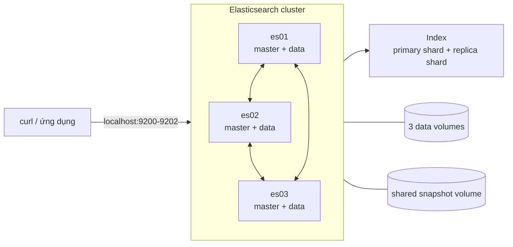

# Lab Elasticsearch độc lập bằng Docker Compose

Tài liệu này tách riêng phần Elasticsearch khỏi project Kafka–Elasticsearch. Lab dựng cluster ba node để học từ REST API, index, mapping và search đến shard allocation, quorum, failover, optimistic concurrency, reindex và snapshot/restore.

> Phạm vi: môi trường học tập trên một Docker host. Security/TLS đang tắt để tập trung vào cơ chế; chỉ bind REST API vào `127.0.0.1`, không mở ra Internet.

## 1. Yêu cầu

- Docker Desktop hoặc Docker Engine đang chạy.
- Docker Compose plugin và ít nhất khoảng 4 GB RAM trống cho cluster.
- Các cổng `9200`, `9201`, `9202` chưa bị chiếm.
- Linux/WSL kernel có `vm.max_map_count` đủ lớn; xem phần xử lý lỗi trong README tổng.
- Chạy lệnh tại thư mục `kafka-elasticsearch-lab`.

## 2. Docker Compose của lab Elasticsearch

Cấu hình đã được tách riêng tại [docker-compose.elasticsearch.yml](./docker-compose.elasticsearch.yml). File chỉ chứa job cấp quyền snapshot và ba node Elasticsearch; không có Kafka, API, indexer hoặc web.

Kiểm tra cấu hình trước khi chạy:

```bash
docker compose -f docker-compose.elasticsearch.yml config --quiet
docker compose -f docker-compose.elasticsearch.yml config
```

Mọi lệnh B0–B16 đều chỉ định `-f docker-compose.elasticsearch.yml` để dùng đúng project `elasticsearch-lab` và bộ volume độc lập với project tích hợp.

## 3. Sơ đồ khái quát



Ba node đều master-eligible và data node. Cluster bầu một elected master để quản lý cluster state; request đọc/ghi có thể vào bất kỳ node nào. Mỗi primary shard và replica của nó không nằm cùng node. Đây là failover giữa process/node trong cùng Docker host, chưa phải HA giữa các máy vật lý.

## 4. Giải thích setting hiện tại

### 4.1. Cluster, discovery và allocation

| Setting | Giá trị | Mục đích |
|---|---|---|
| `cluster.name` | `elasticsearch-lab` | Ba node cùng tên cluster mới discovery và join với nhau. |
| `discovery.seed_hosts` | `es01,es02,es03` | Danh sách địa chỉ ban đầu để node tìm các master-eligible node khác. |
| `cluster.initial_master_nodes` | `es01,es02,es03` | Danh sách bootstrap cho lần hình thành cluster đầu tiên. Production chỉ dùng khi bootstrap cluster mới. |
| `node.name` | `es01`, `es02`, `es03` | Tên ổn định để đọc cat API, allocation và log. |
| `xpack.security.enabled` | `false` | Tắt user/password và TLS cho lab. Không dùng cấu hình này khi mở cluster ra mạng ngoài. |

Lab giữ `cluster.initial_master_nodes` để người học có thể chạy lại từ volume rỗng sau `down -v`. Vì vậy sau khi cluster đã có UUID, log có thể cảnh báo nên bỏ setting này. Cảnh báo đó không làm bài lab thất bại; với cluster production đã bootstrap, phải xóa setting để tránh nguy cơ bootstrap nhầm cluster mới.

### 4.2. Memory, storage và healthcheck

| Setting | Giá trị | Mục đích |
|---|---|---|
| `ES_JAVA_OPTS` | `-Xms768m -Xmx768m` | Heap cố định 768 MB mỗi node; ba node dùng khoảng 2.25 GB heap, chưa tính filesystem cache/native memory. |
| `path.repo` | `/snapshots` | Cho phép đăng ký filesystem snapshot repository tại shared volume này. |
| Data volumes | Một volume cho mỗi node | Giữ Lucene index, translog và cluster metadata của node khi recreate container. |
| `es_snapshots` | Volume dùng chung | Cả ba node nhìn thấy cùng snapshot repository; không thay thế remote backup trong production. |
| Healthcheck | Chờ cluster đạt ít nhất `yellow` | `yellow` nghĩa primary đã assigned và cluster phục vụ được, dù một số replica chưa assigned. |
| `start_period` / `retries` | `50s` / `30` | Cho JVM và cluster đủ thời gian bootstrap trước khi Compose đánh dấu unhealthy. |

### 4.3. Service và port

| Thành phần | Giải thích |
|---|---|
| `es-setup` | Job one-shot chạy bằng root để đặt owner/quyền cho shared snapshot volume; exit 0 là đúng. |
| `depends_on: service_completed_successfully` | Chỉ start node sau khi quyền snapshot volume đã được sửa thành công. |
| `127.0.0.1:9200-9202` | Host truy cập lần lượt es01–es03; container nào cũng nghe REST port 9200 bên trong. |
| Image có version mặc định | Dùng `${ELASTIC_VERSION:-8.19.19}`; có thể override qua `.env`, mặc định được pin để lab lặp lại. |

## 5. Lộ trình lab

- **Cơ bản — B0 đến B7:** REST API, khái niệm index/document/shard, mapping, analyzer, CRUD, full-text query, filter và aggregation.
- **Trung cấp — B8 đến B15:** segment/translog, master election, quorum, unassigned shard, partial failure, concurrency, deep pagination, reindex/alias và backup.
- **Vận hành — B16:** checklist chẩn đoán các lỗi thường gặp.

Mỗi bài bên dưới có mục tiêu, lệnh thực hành, đầu ra dự kiến và giải thích nguyên nhân. Các ID node/shard, thời gian và thứ tự dòng có thể khác giữa các lần chạy; hãy đối chiếu bản chất trạng thái thay vì khớp cứng toàn bộ output.

---

## B0. Khởi động lab Elasticsearch độc lập

> **Mục đích:** Khởi động đúng ba node, xác nhận elected master và cluster đạt `green`. **Trọng tâm:** Compose healthcheck, job `es-setup`, REST endpoint và cluster health.

Phần B không cần Kafka hoặc application:

```bash
docker compose -f docker-compose.elasticsearch.yml up -d es-setup es01 es02 es03
docker compose -f docker-compose.elasticsearch.yml ps es-setup es01 es02 es03

until curl -fsS 'localhost:9200/_cluster/health?wait_for_status=green&timeout=90s' \
  | jq; do sleep 5; done
```

`es-setup` chỉ sửa quyền shared snapshot volume rồi exit 0. Ba node còn lại đều master-eligible, data, ingest và coordinating để mô phỏng cluster nhỏ thực tế. Host có thể gọi từng node qua `9200`, `9201`, `9202`.

Các tùy chọn `curl`/`jq` thường dùng:

| Tham số | Tác dụng |
|---|---|
| `-s` / `-S` / `-f` | Silent; vẫn hiện lỗi; và trả exit code khác 0 khi HTTP 4xx/5xx. Có thể ghép thành `-fsS` cho script chờ. |
| `-X PUT/POST/DELETE` | Chỉ rõ HTTP method. GET là mặc định nên thường không cần `-X GET`. |
| `-H 'Content-Type: application/json'` | Báo request body là JSON; Bulk dùng `application/x-ndjson`. |
| `-d '<json>'` | Gửi request body; phù hợp JSON ngắn. |
| `--data-binary @-` | Đọc nguyên byte từ stdin, giữ newline; bắt buộc hữu ích với Bulk NDJSON. |
| `jq` | Format/lọc JSON để chỉ giữ trường cần quan sát; không làm thay đổi response từ Elasticsearch. |
| `wait_for_status=green&timeout=90s` | Long-poll đến khi đạt trạng thái hoặc hết timeout, dễ dùng hơn `sleep` cố định. |

> ✅ **Đầu ra dự kiến:** `es01`, `es02`, `es03` là `healthy`; `es-setup` là `Exited (0)`. Health trả `status: "green"`, `number_of_nodes: 3`.
>
> **Tại sao:** green chỉ xuất hiện khi mọi primary và replica shard đều assigned. Job setup hoàn tất rồi dừng vì nhiệm vụ duy nhất là sửa quyền snapshot volume.

> 📸 **BÁO CÁO B0:** Chụp ba node healthy và cluster health green. Ghi tên cluster `elasticsearch-lab` cùng port từng node.

## B1. Kiến thức nền

> **Mục đích:** Hiểu dữ liệu đi từ JSON document đến Lucene shard/segment trước khi thao tác API. **Trọng tâm:** index, mapping, primary/replica shard, segment, translog, refresh, flush và scatter/gather.

Elasticsearch là search và analytics engine phân tán dựa trên Apache Lucene. Dữ liệu là JSON document. Các khái niệm chính:

| Khái niệm | Vai trò |
|---|---|
| Cluster / node | Cụm và một tiến trình Elasticsearch |
| Index | Không gian logic chứa các document cùng mapping |
| Mapping | Schema và cách index từng field |
| Primary shard | Một Lucene index độc lập, chứa một phần document |
| Replica shard | Bản sao primary để chịu lỗi và tăng năng lực đọc |
| Segment | Cấu trúc Lucene bất biến chứa inverted index |
| Translog | Nhật ký phục hồi thao tác chưa được Lucene commit |
| Refresh | Mở segment mới cho search, tạo tính near real-time |
| Flush | Lucene commit và tạo translog generation mới |

Luồng ghi rút gọn:

```text
request → primary shard → translog + indexing buffer → replica
                                  |
                               refresh
                                  v
                         Lucene segment searchable
                                  |
                                merge
```

Luồng search phân tán là scatter/gather: coordinating node gửi query đến một bản sao của mỗi shard, gom top kết quả, sau đó fetch `_source` của các document cần trả.

> ✅ **Đầu ra dự kiến:** Sau B1, bạn phải vẽ được write path và giải thích: refresh quyết định search visibility; translog/Lucene commit liên quan durability; replica phục vụ failover/read scaling.
>
> **Tại sao:** Elasticsearch API che giấu Lucene phía dưới, nhưng các hiện tượng NRT, segment count và recovery đều xuất phát từ write path này.

## B2. Lab cluster health, node và shard

> **Mục đích:** Làm quen các API vận hành thông dụng và quan sát cách Elasticsearch phân bổ primary/replica shard. **Trọng tâm:** `_cluster/health`, `_cat/nodes`, `_cat/indices`, `_cat/shards`, số shard và replica.

```bash
curl -s localhost:9200/_cluster/health | jq
curl -s 'localhost:9200/_cat/nodes?v&h=name,ip,node.role,master,heap.percent,ram.percent,cpu'
curl -s 'localhost:9200/_cat/indices?v'
```

Ký hiệu `*` trong cột `master` là elected master hiện tại; hai node còn lại vẫn master-eligible. Tạo index riêng, không phụ thuộc project:

```bash
curl -s -X PUT localhost:9200/products-lab-v1 \
  -H 'Content-Type: application/json' \
  -d '{
    "settings":{
      "number_of_shards":3,
      "number_of_replicas":2,
      "index.write.wait_for_active_shards":"2",
      "refresh_interval":"30s",
      "analysis":{"analyzer":{"lab_text":{
        "type":"custom","tokenizer":"standard",
        "filter":["lowercase","asciifolding"]
      }}}
    },
    "mappings":{
      "dynamic":"strict",
      "properties":{
        "productId":{"type":"keyword"},
        "name":{"type":"text","analyzer":"lab_text","fields":{"raw":{"type":"keyword"}}},
        "description":{"type":"text","analyzer":"lab_text"},
        "category":{"type":"keyword"},
        "price":{"type":"scaled_float","scaling_factor":100},
        "stock":{"type":"integer"},
        "createdAt":{"type":"date"}
      }
    }
  }' | jq
```

Kiểm tra phân bổ:

```bash
curl -s 'localhost:9200/_cat/indices/products-lab-v1?v'
curl -s 'localhost:9200/_cat/shards/products-lab-v1?v&h=index,shard,prirep,state,node'
curl -s localhost:9200/_cluster/health/products-lab-v1 \
  | jq '{status,number_of_nodes,active_primary_shards,active_shards,unassigned_shards}'
```

Ba primary × (1 primary + 2 replica) = 9 shard copy. Cùng shard ID phải nằm trên ba node khác nhau. `number_of_replicas=2` nghĩa hai replica **ngoài** primary.

> ✅ **Đầu ra dự kiến:** Index creation trả `acknowledged: true`; `_cat/shards` có 9 dòng `STARTED`; health index có `active_primary_shards: 3`, `active_shards: 9`, `unassigned_shards: 0` và trạng thái green.
>
> **Tại sao:** ba primary chia dữ liệu; mỗi primary có thêm hai replica. Elasticsearch cấm đặt primary và replica cùng shard ID trên một node nên ba bản được trải qua ba node.

> 📸 **BÁO CÁO B2:** Chụp `_cat/nodes`, 9 dòng `_cat/shards` và health green. Đánh dấu một shard ID với primary cùng hai replica trên ba node.

## B3. Lab mapping: `text`, `keyword`, kiểu số và date

> **Mục đích:** Chọn đúng kiểu field và dùng strict mapping để phát hiện dữ liệu sai schema. **Trọng tâm:** `text`, `keyword`, multi-field, `scaled_float`, `date` và `dynamic: strict`.

Xem mapping lab:

```bash
curl -s localhost:9200/products-lab-v1/_mapping | jq
```

- `name` là `text`: analyzer tách thành term để full-text search; subfield `name.raw` là `keyword` để sort/aggregation chính xác.
- `category`, `productId` là `keyword`: giữ nguyên giá trị để term filter và aggregation.
- `price` là `scaled_float`: lưu số thập phân với hệ số 100.
- `stock` là integer; `createdAt` là date.
- `dynamic: strict`: field lạ làm request bị từ chối, giúp phát hiện schema drift.

Thử đưa field không khai báo:

```bash
curl -s -X POST 'localhost:9200/products-lab-v1/_doc?refresh=true' \
  -H 'Content-Type: application/json' \
  -d '{"id":"bad-1","unknownField":"should fail"}' | jq
```

Request phải trả lỗi `strict_dynamic_mapping_exception`.

> ✅ **Đầu ra dự kiến:** Mapping cho thấy `name` là `text` có subfield `raw: keyword`, `category` là `keyword`, `price` là `scaled_float`. Request có `unknownField` trả HTTP 400 với `strict_dynamic_mapping_exception`.
>
> **Tại sao:** `dynamic: strict` yêu cầu mọi field có trong mapping. Payload còn dùng field `id` không khai báo, nên Elasticsearch có thể nêu `id` là field vi phạm đầu tiên thay vì `unknownField`; cả hai đều chứng minh strict mapping hoạt động.

> 📸 **BÁO CÁO B3:** Chụp mapping `name`, `category`, `price` và lỗi strict mapping. Ghi vì sao không dùng `text` cho aggregation category.

## B4. Lab analyzer và inverted index

> **Mục đích:** Quan sát chuỗi đầu vào được biến thành term dùng cho full-text search. **Trọng tâm:** tokenizer, lowercase, asciifolding, keyword analyzer và inverted index.

Analyzer `lab_text` dùng standard tokenizer, lowercase và asciifolding. Kiểm tra token:

```bash
curl -s -X POST localhost:9200/products-lab-v1/_analyze \
  -H 'Content-Type: application/json' \
  -d '{
    "analyzer":"lab_text",
    "text":"Tai Nghe Bluetooth Chống Ồn!"
  }' | jq '.tokens[] | {token,position}'
```

Các token đã viết thường; asciifolding giúp query không dấu như `chong on` khớp dữ liệu có dấu trong phạm vi analyzer đơn giản của lab. Inverted index ánh xạ term → danh sách document chứa term, nhờ đó không phải quét toàn bộ `_source`.

So sánh `text` và `keyword`:

```bash
curl -s -X POST localhost:9200/products-lab-v1/_analyze \
  -H 'Content-Type: application/json' \
  -d '{"analyzer":"keyword","text":"Tai Nghe Chống Ồn"}' \
  | jq '.tokens[].token'
```

Keyword analyzer tạo đúng một token giữ nguyên chuỗi.

> ✅ **Đầu ra dự kiến:** `lab_text` tạo các token gần như `tai`, `nghe`, `bluetooth`, `chong`, `on`; keyword analyzer trả đúng một token `Tai Nghe Chống Ồn`.
>
> **Tại sao:** standard tokenizer tách theo biên từ, lowercase chuẩn hóa chữ hoa và asciifolding bỏ dấu. Keyword analyzer xem cả chuỗi là một token.

> 📸 **BÁO CÁO B4:** Chụp token của hai analyzer và mô tả inverted index bằng một ví dụ 2 document, 3 term.

## B5. Lab CRUD và near real-time

> **Mục đích:** Thực hành create/read/update/delete và chứng minh GET real-time khác search near real-time. **Trọng tâm:** refresh interval, `_refresh`, `_doc`, `_update`, delete và search visibility.

Index document nhưng chưa ép refresh:

```bash
curl -s -X PUT localhost:9200/products-lab-v1/_settings \
  -H 'Content-Type: application/json' \
  -d '{"index":{"refresh_interval":"-1"}}' | jq

curl -s -X PUT localhost:9200/products-lab-v1/_doc/p-nrt-001 \
  -H 'Content-Type: application/json' \
  -d '{
    "productId":"p-nrt-001",
    "name":"Tai nghe chống ồn",
    "description":"Sản phẩm dùng kiểm tra near real-time",
    "category":"electronics",
    "price":2390000,
    "stock":12,
    "createdAt":"2026-07-30T10:00:00Z"
  }' | jq

curl -s localhost:9200/products-lab-v1/_doc/p-nrt-001 | jq '._source'
curl -s -X POST localhost:9200/products-lab-v1/_search \
  -H 'Content-Type: application/json' \
  -d '{"query":{"ids":{"values":["p-nrt-001"]}}}' | jq '.hits.total'
```

GET theo ID có thể thấy document ngay nhờ real-time GET, trong khi search chưa thấy do refresh tự động đang tắt (`refresh_interval=-1`). Ép refresh rồi tìm lại:

```bash
curl -s -X POST localhost:9200/products-lab-v1/_refresh | jq
curl -s -X POST localhost:9200/products-lab-v1/_search \
  -H 'Content-Type: application/json' \
  -d '{"query":{"ids":{"values":["p-nrt-001"]}}}' | jq '.hits'
```

Update và delete:

```bash
curl -s -X POST localhost:9200/products-lab-v1/_update/p-nrt-001 \
  -H 'Content-Type: application/json' \
  -d '{"doc":{"price":2290000,"stock":11}}' | jq

curl -s -X DELETE 'localhost:9200/products-lab-v1/_doc/p-nrt-001?refresh=true' | jq
curl -s -X PUT localhost:9200/products-lab-v1/_settings \
  -H 'Content-Type: application/json' \
  -d '{"index":{"refresh_interval":"30s"}}' | jq
```

Không dùng `refresh=true` cho mọi write trong production vì tạo nhiều segment nhỏ và tăng chi phí merge.

> ✅ **Đầu ra dự kiến:** PUT document trả `result: created`; GET theo ID thấy `_source`; search trước refresh có `value: 0`, sau `_refresh` có `value: 1`. Update trả `result: updated`, delete trả `result: deleted`.
>
> **Tại sao:** real-time GET có thể đọc từ translog/version map, còn search chỉ đọc Lucene searcher đã refresh. Refresh mở segment/searcher mới nên document mới xuất hiện trong search.

> 📸 **BÁO CÁO B5:** Chụp GET thấy document nhưng search có 0 hit trước refresh, rồi search có hit sau refresh. Đây là bằng chứng near real-time.

## B6. Lab full-text query, filter và relevance score

> **Mục đích:** Nạp nhiều document và phân biệt truy vấn có tính điểm với filter chính xác. **Trọng tâm:** Bulk NDJSON, `match`, `multi_match`, `term`, `bool`, boost và BM25 `_score`.

Nạp dữ liệu độc lập bằng Bulk API. NDJSON bắt buộc có newline cuối và mỗi action/source nằm trên một dòng riêng:

```bash
curl -s -X POST 'localhost:9200/products-lab-v1/_bulk?refresh=wait_for' \
  -H 'Content-Type: application/x-ndjson' --data-binary @- <<'NDJSON' | jq
{"index":{"_id":"p-001"}}
{"productId":"p-001","name":"Tai nghe chống ồn cao cấp","description":"Tai nghe bluetooth âm thanh rõ","category":"electronics","price":2390000,"stock":15,"createdAt":"2026-07-30T10:00:00Z"}
{"index":{"_id":"p-002"}}
{"productId":"p-002","name":"Bàn phím cơ không dây","description":"Bàn phím cơ switch brown","category":"electronics","price":1450000,"stock":8,"createdAt":"2026-07-30T10:01:00Z"}
{"index":{"_id":"p-003"}}
{"productId":"p-003","name":"Sách Kafka căn bản","description":"Event streaming và hệ thống phân tán","category":"books","price":320000,"stock":30,"createdAt":"2026-07-30T10:02:00Z"}
{"index":{"_id":"p-004"}}
{"productId":"p-004","name":"Sách thiết kế hệ thống","description":"Kiến trúc phần mềm thực hành","category":"books","price":410000,"stock":20,"createdAt":"2026-07-30T10:03:00Z"}
{"index":{"_id":"p-005"}}
{"productId":"p-005","name":"Máy pha cà phê tự động","description":"Máy pha cà phê cho gia đình","category":"home","price":5200000,"stock":4,"createdAt":"2026-07-30T10:04:00Z"}
{"index":{"_id":"p-006"}}
{"productId":"p-006","name":"Tai nghe thể thao","description":"Tai nghe chống nước cho chạy bộ","category":"electronics","price":890000,"stock":0,"createdAt":"2026-07-30T10:05:00Z"}
NDJSON
```

Luôn kiểm tra `.errors`; Bulk API có thể trả HTTP 200 nhưng một vài item bên trong thất bại:

```bash
curl -s localhost:9200/products-lab-v1/_count | jq
```

Full-text `match` sử dụng analyzer và tính `_score`:

```bash
curl -s -X POST localhost:9200/products-lab-v1/_search \
  -H 'Content-Type: application/json' \
  -d '{
    "query":{"match":{"name":{"query":"chong on","fuzziness":"AUTO"}}},
    "_source":["name","category","price"]
  }' | jq '.hits.hits[] | {_score,source:._source}'
```

Vì bật fuzziness, query trên có thể trả thêm kết quả gần đúng như `không` so với `chống`. Muốn buộc cả hai term sau analyzer khớp chính xác hơn, bỏ fuzziness và dùng `operator: and`:

```bash
curl -s -X POST localhost:9200/products-lab-v1/_search \
  -H 'Content-Type: application/json' \
  -d '{
    "query":{"match":{"name":{"query":"chong on","operator":"and"}}},
    "_source":["name","category","price"]
  }' | jq '.hits.hits[] | {_score,source:._source}'
```

Kết hợp query và filter:

```bash
curl -s -X POST localhost:9200/products-lab-v1/_search \
  -H 'Content-Type: application/json' \
  -d '{
    "query":{"bool":{
      "must":[{"multi_match":{"query":"tai nghe","fields":["name^3","description"]}}],
      "filter":[{"term":{"category":"electronics"}}]
    }}
  }' | jq '.hits.hits[] | {_score,name:._source.name}'
```

`must` đóng góp vào relevance score; `filter` kiểm tra chính xác, không tính score và có khả năng cache. `name^3` boost tên cao hơn description. Elasticsearch mặc định dùng BM25, xét tần suất term, độ hiếm term và độ dài field.

> ✅ **Đầu ra dự kiến:** Bulk trả `errors: false`, count bằng 6. Query fuzzy `chong on` có thể trả cả “Tai nghe chống ồn”, “Bàn phím ... không dây” hoặc kết quả gần đúng khác; query `operator: and` không fuzziness chỉ giữ document có đủ term chính xác. Bool query chỉ trả category `electronics`, mỗi hit có `_score`.
>
> **Tại sao:** Bulk `refresh=wait_for` chờ refresh nên sáu document tìm được ngay. `match` phân tích query bằng analyzer; fuzziness chấp nhận edit distance nên tăng recall nhưng giảm precision. `term` trong filter so khớp chính xác keyword; boost `name^3` nhân trọng số field tên.

> 📸 **BÁO CÁO B6:** Chụp Bulk response không lỗi và kết quả có `_score`; giải thích `match` khác `term` và tác dụng của boost `^3`.

## B7. Lab aggregation

> **Mục đích:** Tổng hợp dữ liệu theo bucket và metric thay vì lấy từng document. **Trọng tâm:** `size:0`, terms, range, avg, sum, doc values và script aggregation.

```bash
curl -s -X POST localhost:9200/products-lab-v1/_search \
  -H 'Content-Type: application/json' \
  -d '{
    "size":0,
    "aggs":{
      "products_by_category":{"terms":{"field":"category"}},
      "inventory_value":{"sum":{"script":{"source":"doc.price.value * doc.stock.value"}}},
      "average_price":{"avg":{"field":"price"}},
      "price_ranges":{"range":{"field":"price","ranges":[{"to":1000000},{"from":1000000,"to":3000000},{"from":3000000}]}}
    }
  }' | jq '.aggregations'
```

`size: 0` bỏ phần hits khi chỉ cần thống kê. Terms aggregation dùng dữ liệu chính xác của keyword/doc values, không dùng chuỗi text đã tách token.

> ✅ **Đầu ra dự kiến:** Category có `electronics: 3`, `books: 2`, `home: 1`; ba khoảng giá lần lượt có 3, 2, 1 sản phẩm. Average price khoảng `1,776,666.67`; inventory value là `86,050,000` với đúng bộ dữ liệu B6.
>
> **Tại sao:** aggregation chạy trên toàn bộ document khớp query (ở đây mặc định là tất cả). Script nhân `price × stock` trên từng document rồi sum, nên linh hoạt nhưng tốn CPU hơn đọc trực tiếp một field đã chuẩn bị sẵn.

> 📸 **BÁO CÁO B7:** Chụp bucket category, khoảng giá và inventory value. Giải thích vì sao script aggregation tốn CPU hơn field aggregation.

## B8. Segment, translog, flush và merge

> **Mục đích:** Phân biệt durability của write với khả năng nhìn thấy document trong search. **Trọng tâm:** indexing buffer, translog, refresh, immutable segment, flush và merge.

```bash
curl -s 'localhost:9200/_cat/segments/products-lab-v1?v'
curl -s -X POST localhost:9200/products-lab-v1/_flush | jq
curl -s 'localhost:9200/_cat/segments/products-lab-v1?v'
```

- Refresh làm segment có thể search nhưng không đồng nghĩa một Lucene commit hoàn chỉnh.
- Translog được fsync để phục hồi các operation được xác nhận nhưng chưa flush.
- Flush tạo Lucene commit và bắt đầu translog generation mới.
- Segment bất biến; update/delete tạo phiên bản mới hoặc đánh dấu xóa. Merge nền gộp segment và dọn document đã xóa.
- Không chạy force merge thường xuyên trên index đang ghi.

> ✅ **Đầu ra dự kiến:** `_cat/segments` liệt kê một hoặc nhiều segment cho mỗi primary/replica; `_flush` trả `_shards.failed: 0`. Số segment không bắt buộc giảm ngay sau flush.
>
> **Tại sao:** flush tạo Lucene commit và translog generation mới, không phải force merge. Merge là tiến trình nền riêng nên output segment phụ thuộc thời điểm chạy.

> 📝 **BÁO CÁO B8:** Vẽ write path từ HTTP request đến translog, buffer, refresh, segment và flush; phân biệt durability với search visibility.

## B9. Lab master election, primary promotion và node failure

> **Mục đích:** Mô phỏng mất một node và quan sát master election, primary promotion cùng replica recovery. **Trọng tâm:** elected master, health `yellow`, shard role và failover qua endpoint còn sống.

Xác định elected master, sau đó dừng đúng node đó:

```bash
MASTER=$(curl -fsS 'localhost:9200/_cat/master?h=node')
echo "Elected master before failure: $MASTER"
docker compose -f docker-compose.elasticsearch.yml stop "$MASTER"
docker compose -f docker-compose.elasticsearch.yml ps es01 es02 es03
```

Chọn endpoint còn sống và chờ cluster ổn định:

```bash
for port in 9200 9201 9202; do
  if curl -fsS "localhost:${port}" >/dev/null 2>&1; then
    ES_SURVIVOR="http://localhost:${port}"
    break
  fi
done
echo "$ES_SURVIVOR"

curl -s "$ES_SURVIVOR/_cluster/health?wait_for_status=yellow&timeout=60s" \
  | jq '{status,number_of_nodes,active_primary_shards,active_shards,unassigned_shards}'
curl -s "$ES_SURVIVOR/_cat/master?v"
curl -s "$ES_SURVIVOR/_cat/shards/products-lab-v1?v&h=shard,prirep,state,node"
```

Kết quả đúng:

- Một trong hai master-eligible node còn lại được bầu làm master.
- Replica trên node sống được promote nếu primary cũ nằm trên node đã dừng.
- Tất cả primary vẫn active nên đọc/ghi được; health `yellow` vì mỗi shard thiếu bản sao thứ ba.
- `number_of_replicas=2` không buộc cluster ngừng chỉ vì tạm thiếu một replica.

Ghi thử qua node sống:

```bash
curl -s -X PUT "$ES_SURVIVOR/products-lab-v1/_doc/p-failover?refresh=wait_for" \
  -H 'Content-Type: application/json' \
  -d '{
    "productId":"p-failover","name":"Sản phẩm khi một node dừng",
    "description":"primary promotion test","category":"lab",
    "price":100000,"stock":1,"createdAt":"2026-07-30T11:00:00Z"
  }' | jq
```

Khôi phục node và chờ replica recovery:

```bash
docker compose -f docker-compose.elasticsearch.yml start "$MASTER"
until curl -fsS 'localhost:9200/_cluster/health?wait_for_status=green&timeout=10s' \
  | jq '{status,number_of_nodes,active_shards,relocating_shards,initializing_shards}'; do
  sleep 3
done
```

> ✅ **Đầu ra dự kiến:** Elected master đổi sang node sống; health tạm `yellow`, `number_of_nodes: 2`, primary vẫn active và write `p-failover` thành công. Sau start node cũ, health trở lại green và đủ ba node.
>
> **Tại sao:** majority 2/3 vẫn bầu được master. Replica trên node sống được promote thành primary; thiếu một bản replica chỉ làm yellow, sau đó peer recovery chép shard sang node quay lại. Vòng `until` cần thiết vì `docker compose -f docker-compose.elasticsearch.yml start` chỉ đảm bảo container đã start, chưa đảm bảo REST API trong JVM đã sẵn sàng.

> 📸 **BÁO CÁO B9:** Chụp master trước/sau, health yellow, shard promotion và health green sau recovery. Ghi rõ node failover khác host failover: cả ba container vẫn nằm trên một Docker host.

## B10. Lab mất quorum Elasticsearch

> **Mục đích:** Chứng minh replica dữ liệu không thay thế được quorum của control plane. **Trọng tâm:** majority 2/3, no-master state, `master_timeout` và phục hồi cluster.

Ba master-eligible node chỉ chịu được **một** node lỗi. Dừng hai node:

```bash
docker compose -f docker-compose.elasticsearch.yml stop es02 es03
curl --max-time 8 -sS -i \
  'localhost:9200/_cluster/health?master_timeout=5s'
docker compose -f docker-compose.elasticsearch.yml logs --tail=40 es01
```

Node còn lại có thể vẫn giữ local shard nhưng không có majority để bầu master, nên cluster từ chối phần lớn thao tác. Hai replica không đồng nghĩa có thể vận hành cluster với một trong ba master node.

Khôi phục ngay và chờ green:

```bash
docker compose -f docker-compose.elasticsearch.yml start es02 es03
curl -s 'localhost:9200/_cluster/health?wait_for_status=green&timeout=120s' | jq
```

> ✅ **Đầu ra dự kiến:** Khi chỉ còn `es01`, health request thường trả HTTP 503 với `master_not_discovered_exception`, timeout hoặc log báo không đủ master nodes. Sau start `es02`, `es03`, cluster bầu master và trở lại green.
>
> **Tại sao:** cluster ba master-eligible node cần majority 2. Một node không được tự bầu để tránh split-brain, dù local disk của nó vẫn chứa shard data.

> 📸 **BÁO CÁO B10:** Chụp lỗi/no-master khi còn một node và health green sau phục hồi. Giải thích quorum `floor(N/2)+1`.

## B11. Lab unassigned shard và Allocation Explain

> **Mục đích:** Tạo một lỗi allocation thường gặp và dùng API giải thích thay vì đoán nguyên nhân. **Trọng tâm:** replica count, health `yellow`, same-shard decider và `_cluster/allocation/explain`.

Cố ý yêu cầu ba replica trên cluster ba node. Một shard sẽ cần bốn node khác nhau nên không thể phân bổ đủ:

```bash
curl -s -X PUT localhost:9200/products-lab-v1/_settings \
  -H 'Content-Type: application/json' \
  -d '{"index":{"number_of_replicas":3}}' | jq

curl -s localhost:9200/_cluster/health/products-lab-v1 \
  | jq '{status,active_primary_shards,active_shards,unassigned_shards}'
curl -s -X POST localhost:9200/_cluster/allocation/explain \
  -H 'Content-Type: application/json' \
  -d '{"index":"products-lab-v1","shard":0,"primary":false}' \
  | jq '{index,shard,primary,current_state,allocate_explanation,node_allocation_decisions}'
```

Allocation decider phải cho biết không được đặt hai bản của cùng shard trên một node. Trả về hai replica:

```bash
curl -s -X PUT localhost:9200/products-lab-v1/_settings \
  -H 'Content-Type: application/json' \
  -d '{"index":{"number_of_replicas":2}}' | jq
curl -s 'localhost:9200/_cluster/health?wait_for_status=green&timeout=60s' | jq '.status'
```

> ✅ **Đầu ra dự kiến:** Khi replicas=3, health yellow và `unassigned_shards: 3`; allocation explain có quyết định `NO` từ same-shard decider. Trả replicas về 2 làm health green.
>
> **Tại sao:** mỗi trong ba primary cần ba replica, tức bốn node riêng cho cùng shard ID, nhưng cluster chỉ có ba node. Primary vẫn assigned nên yellow chứ không red.

> 📸 **BÁO CÁO B11:** Chụp health yellow, allocation explanation và health green sau khi sửa. Đây là quy trình đầu tiên khi gặp unassigned shard thực tế.

## B12. Lab Bulk partial failure và optimistic concurrency

> **Mục đích:** Xử lý hai tình huống production phổ biến: Bulk HTTP 200 nhưng có item lỗi và concurrent update gây lost update. **Trọng tâm:** `errors`, item status, `_seq_no`, `_primary_term` và HTTP 409.

Bulk API trả HTTP 200 không đảm bảo mọi item thành công. Gửi một document đúng và một document có field lạ trong mapping strict:

```bash
curl -s -X POST 'localhost:9200/products-lab-v1/_bulk?refresh=wait_for' \
  -H 'Content-Type: application/x-ndjson' --data-binary @- <<'NDJSON' \
  | tee /tmp/bulk-result.json | jq '{errors,items}'
{"index":{"_id":"bulk-ok"}}
{"productId":"bulk-ok","name":"Bulk hợp lệ","description":"ok","category":"lab","price":1000,"stock":1,"createdAt":"2026-07-30T12:00:00Z"}
{"index":{"_id":"bulk-bad"}}
{"productId":"bulk-bad","name":"Bulk lỗi","description":"bad","category":"lab","price":1000,"stock":1,"createdAt":"2026-07-30T12:00:00Z","unexpected":"field"}
NDJSON
```

Phải kiểm tra `errors=true` và status từng item để retry **chỉ item lỗi**, không gửi lại mù toàn batch.

Tiếp theo lấy sequence number và primary term của `p-001`:

```bash
DOC=$(curl -fsS localhost:9200/products-lab-v1/_doc/p-001)
SEQ_NO=$(echo "$DOC" | jq -r '._seq_no')
PRIMARY_TERM=$(echo "$DOC" | jq -r '._primary_term')
echo "seq_no=$SEQ_NO primary_term=$PRIMARY_TERM"

curl -s -X POST \
  "localhost:9200/products-lab-v1/_update/p-001?if_seq_no=${SEQ_NO}&if_primary_term=${PRIMARY_TERM}" \
  -H 'Content-Type: application/json' -d '{"doc":{"stock":14}}' | jq
```

Gửi lại chính request với sequence number cũ sẽ nhận HTTP 409 `version_conflict_engine_exception`:

```bash
curl -s -X POST \
  "localhost:9200/products-lab-v1/_update/p-001?if_seq_no=${SEQ_NO}&if_primary_term=${PRIMARY_TERM}" \
  -H 'Content-Type: application/json' -d '{"doc":{"stock":13}}' | jq
```

> ✅ **Đầu ra dự kiến:** Bulk HTTP response có `errors: true`; item `bulk-ok` status 201, `bulk-bad` status 400. Update OCC đầu thành công; request thứ hai dùng token cũ trả HTTP 409 `version_conflict_engine_exception`.
>
> **Tại sao:** Bulk xử lý từng item độc lập. Update đầu tăng sequence number nên điều kiện cũ không còn đúng; Elasticsearch từ chối write thứ hai thay vì âm thầm ghi đè thay đổi mới.

> 📸 **BÁO CÁO B12:** Chụp Bulk partial failure và lỗi 409. Giải thích lost update và cách client đọc lại rồi retry có kiểm soát.

## B13. Lab pagination an toàn với `search_after`

> **Mục đích:** Phân trang sâu mà không buộc mỗi shard giữ lượng lớn kết quả trung gian. **Trọng tâm:** deterministic sort, tie-breaker, sort token, `search_after` và PIT.

`from + size` phù hợp trang nông; mặc định không vượt `index.max_result_window=10000`. Với trang sâu, dùng sort ổn định và `search_after`:

```bash
FIRST_PAGE=$(curl -fsS -X POST localhost:9200/products-lab-v1/_search \
  -H 'Content-Type: application/json' \
  -d '{
    "size":2,
    "query":{"match_all":{}},
    "sort":[{"createdAt":"asc"},{"productId":"asc"}]
  }')
echo "$FIRST_PAGE" | jq '.hits.hits[] | {_id,sort,_source}'

SEARCH_AFTER=$(echo "$FIRST_PAGE" | jq -c '.hits.hits[-1].sort')
curl -s -X POST localhost:9200/products-lab-v1/_search \
  -H 'Content-Type: application/json' \
  -d "{
    \"size\":2,
    \"query\":{\"match_all\":{}},
    \"sort\":[{\"createdAt\":\"asc\"},{\"productId\":\"asc\"}],
    \"search_after\":${SEARCH_AFTER}
  }" | jq '.hits.hits[] | {_id,sort,_source}'
```

Khi dữ liệu thay đổi liên tục và cần snapshot nhất quán qua nhiều trang, kết hợp Point in Time (PIT) với `search_after`. Không tăng `max_result_window` vô hạn vì mỗi shard phải giữ nhiều kết quả trung gian trong heap.

> ✅ **Đầu ra dự kiến:** Trang đầu trả hai hit cùng mảng `sort`; trang hai bắt đầu sau token của hit cuối trang một và không lặp document. Giá trị `SEARCH_AFTER` là JSON array, thường có dạng `[<epoch_millis>,"p-002"]` vì date sort mặc định trả số; truyền lại nguyên array, không tự đổi format.
>
> **Tại sao:** Elasticsearch so sánh tuple sort `(createdAt, productId)` để tiếp tục. `productId` làm tie-breaker giúp thứ tự xác định khi nhiều document cùng thời gian.

> 📸 **BÁO CÁO B13:** Chụp hai trang và sort token nối tiếp nhau. So sánh `from/size`, scroll và PIT + search_after.

## B14. Lab reindex và chuyển alias không downtime

> **Mục đích:** Thay đổi mapping/index version mà client đọc không phải đổi endpoint. **Trọng tâm:** versioned index, `_reindex`, alias action nguyên tử, cutover và rollback.

Mapping của field đã tồn tại thường không đổi kiểu trực tiếp được. Quy trình thực tế là tạo index version mới, reindex rồi đổi alias nguyên tử.

Gắn alias đọc vào v1:

```bash
curl -s -X POST localhost:9200/_aliases \
  -H 'Content-Type: application/json' \
  -d '{"actions":[{"add":{"index":"products-lab-v1","alias":"products-read"}}]}' | jq
```

Tạo v2 có thêm field `brand`:

```bash
curl -s -X PUT localhost:9200/products-lab-v2 \
  -H 'Content-Type: application/json' \
  -d '{
    "settings":{"number_of_shards":3,"number_of_replicas":2},
    "mappings":{"dynamic":"strict","properties":{
      "productId":{"type":"keyword"},
      "name":{"type":"text","fields":{"raw":{"type":"keyword"}}},
      "description":{"type":"text"},
      "category":{"type":"keyword"},
      "brand":{"type":"keyword"},
      "price":{"type":"scaled_float","scaling_factor":100},
      "stock":{"type":"integer"},
      "createdAt":{"type":"date"}
    }}
  }' | jq

curl -s -X POST 'localhost:9200/_reindex?wait_for_completion=true&refresh=true' \
  -H 'Content-Type: application/json' \
  -d '{"source":{"index":"products-lab-v1"},"dest":{"index":"products-lab-v2"}}' \
  | jq '{took,total,created,updated,failures}'
```

Đổi alias trong **một** request cluster-state:

```bash
curl -s -X POST localhost:9200/_aliases \
  -H 'Content-Type: application/json' \
  -d '{"actions":[
    {"remove":{"index":"products-lab-v1","alias":"products-read"}},
    {"add":{"index":"products-lab-v2","alias":"products-read"}}
  ]}' | jq

curl -s localhost:9200/_alias/products-read | jq
curl -s localhost:9200/products-read/_count | jq
```

Trong production, xử lý cả các write phát sinh trong lúc reindex bằng dual-write, change-data-capture hoặc tạm dừng write ngắn; reindex một lần không tự đồng bộ thay đổi mới.

> ✅ **Đầu ra dự kiến:** Reindex có `failures: []` và `created` bằng count nguồn. Sau cutover, `_alias/products-read` chỉ trỏ `products-lab-v2`; count qua alias bằng count v2.
>
> **Tại sao:** request `_aliases` chứa remove và add được áp dụng nguyên tử trong một cluster-state update, nên client không thấy khoảng trống giữa hai index. `refresh=true` làm document ở destination nhìn thấy được trước khi kiểm tra `_count`; nếu bỏ nó, count ngay sau reindex có thể tạm là 0 do near-real-time refresh. `_reindex` chỉ copy snapshot dữ liệu tại thời điểm chạy.

> 📸 **BÁO CÁO B14:** Chụp reindex không failure, alias trước/sau và count qua alias. Giải thích rollback bằng cách đổi alias ngược lại.

## B15. Lab snapshot và restore

> **Mục đích:** Tạo backup độc lập với replica và kiểm chứng restore sang index mới. **Trọng tâm:** filesystem repository, verify, snapshot state, rename khi restore và count đối chiếu.

Compose đã mount named volume `es_snapshots` chung vào `/snapshots` trên ba node. Đăng ký filesystem repository:

```bash
curl -s -X PUT localhost:9200/_snapshot/lab-repo \
  -H 'Content-Type: application/json' \
  -d '{"type":"fs","settings":{"location":"lab-backups","compress":true}}' | jq

curl -s -X POST localhost:9200/_snapshot/lab-repo/_verify | jq
```

Chụp snapshot v2:

```bash
curl -s -X PUT \
  'localhost:9200/_snapshot/lab-repo/products-snapshot-01?wait_for_completion=true' \
  -H 'Content-Type: application/json' \
  -d '{"indices":"products-lab-v2","include_global_state":false}' \
  | jq '.snapshot | {snapshot,state,indices,shards}'
```

Restore sang tên khác để không đè index đang mở:

```bash
curl -s -X POST \
  'localhost:9200/_snapshot/lab-repo/products-snapshot-01/_restore?wait_for_completion=true' \
  -H 'Content-Type: application/json' \
  -d '{
    "indices":"products-lab-v2",
    "rename_pattern":"products-lab-v2",
    "rename_replacement":"products-lab-restored",
    "include_aliases":false,
    "include_global_state":false
  }' | jq

curl -s localhost:9200/products-lab-restored/_count | jq
curl -s localhost:9200/_snapshot/lab-repo/_all | jq
```

Named volume chung chỉ mô phỏng shared filesystem trên **một Docker host**. Production dùng repository bền vững và độc lập cluster như S3/GCS/Azure/shared filesystem, kèm chính sách SLM và kiểm thử restore định kỳ.

> ✅ **Đầu ra dự kiến:** Verify trả danh sách ba node; snapshot có `state: SUCCESS`, `shards.failed: 0`; index `products-lab-restored` có count bằng v2.
>
> **Tại sao:** snapshot lưu segment theo cơ chế incremental vào repository chung. Restore dùng rename để tạo index khác, cho phép đối chiếu mà không đóng hoặc ghi đè index nguồn. `include_aliases:false` ngăn alias `products-read` của v2 được gắn thêm vào index restored; nếu giữ mặc định, query qua alias có thể đọc cả hai index và đếm trùng.

> 📸 **BÁO CÁO B15:** Chụp verify repository, snapshot SUCCESS và count index restored. Nêu vì sao replica không thay thế backup.

## B16. Checklist sự cố Elasticsearch thường gặp

> **Mục đích:** Xây dựng thứ tự kiểm tra từ cluster → shard → node → request, sau đó dọn tài nguyên lab có chọn lọc. **Trọng tâm:** health, allocation explain, thread pool, mapping, heap, disk, conflict và snapshot verify.

| Hiện tượng | API kiểm tra | Nguyên nhân thường gặp |
|---|---|---|
| Cluster red/yellow | `_cluster/health`, `_cat/shards` | Mất primary/replica, thiếu node |
| Shard unassigned | `_cluster/allocation/explain` | Cùng-shard rule, awareness, disk watermark, allocation filter |
| Write 429 | `_cat/thread_pool/write`, node stats | Queue đầy, bulk quá lớn, consumer nhanh hơn ES |
| Mapping exception | `_mapping`, item lỗi trong `_bulk` | Sai type, field lạ với strict mapping |
| Search chậm | `_search` profile, slow log, hot threads | Query đắt, shard quá nhiều, script/deep pagination |
| Heap cao | `_cat/nodes`, `_nodes/stats/jvm` | Aggregation cardinality cao, fielddata, shard/segment quá nhiều |
| Disk tăng | `_cat/allocation`, ILM, segment | Retention chưa có, replica nhiều, merge/snapshot hiểu sai |
| Version conflict | `_seq_no`, `_primary_term` | Concurrent update; cần OCC/retry có giới hạn |
| Snapshot fail | `_snapshot/.../_verify` | Quyền path, repository không chung, plugin/credential |

Dọn dữ liệu lab riêng sau khi hoàn thành:

```bash
curl -s -X DELETE \
  'localhost:9200/products-lab-v1,products-lab-v2,products-lab-restored?ignore_unavailable=true' | jq
curl -s -X DELETE \
  'localhost:9200/_snapshot/lab-repo/products-snapshot-01' | jq
curl -s -X DELETE localhost:9200/_snapshot/lab-repo | jq
```

> ✅ **Đầu ra dự kiến:** Các index lab, snapshot đã nêu và đăng ký repository không còn tồn tại; cluster chính vẫn chạy.
>
> **Tại sao:** Phải xóa snapshot qua Snapshot API trước khi xóa đăng ký repository để Elasticsearch dọn metadata/blob có tham chiếu đúng cách. Chỉ DELETE repository sẽ gỡ đăng ký nhưng không có nghĩa xóa các snapshot file. Không dùng `down -v` nếu còn cần dữ liệu hoặc snapshot khác trong volume.

---

## Dừng và xóa lab

Dừng và xóa container/network nhưng giữ dữ liệu:

```bash
docker compose -f docker-compose.elasticsearch.yml down
```

Chạy lại cluster với dữ liệu cũ:

```bash
docker compose -f docker-compose.elasticsearch.yml up -d es-setup es01 es02 es03
```

Chỉ xóa toàn bộ data/snapshot volume khi chắc chắn đã hoàn tất:

```bash
docker compose -f docker-compose.elasticsearch.yml down -v
```
