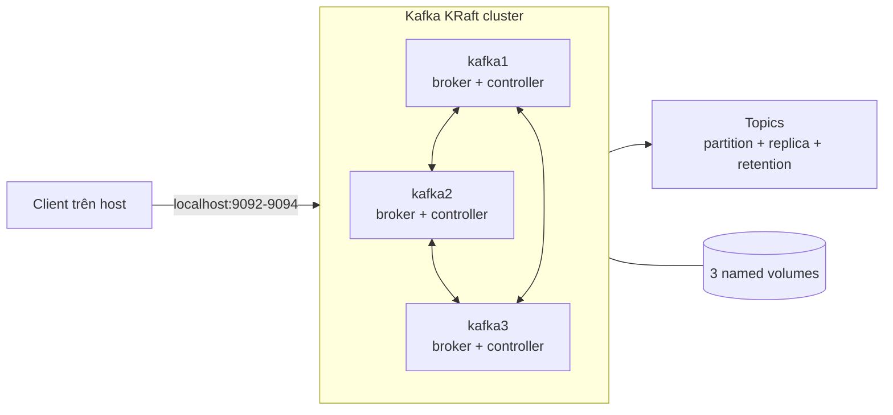
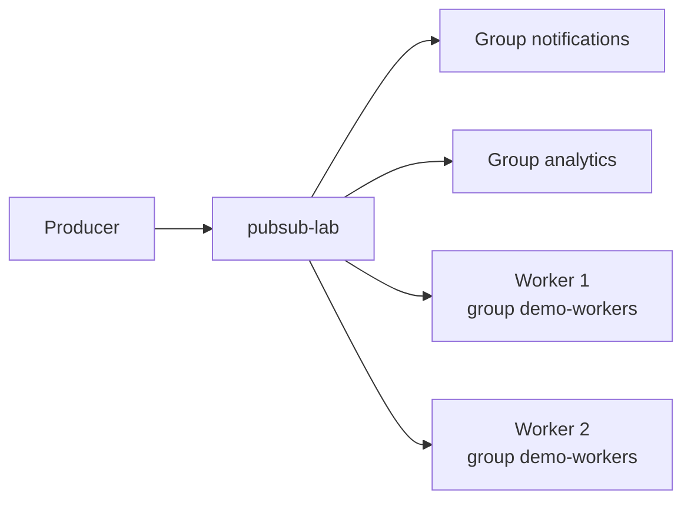
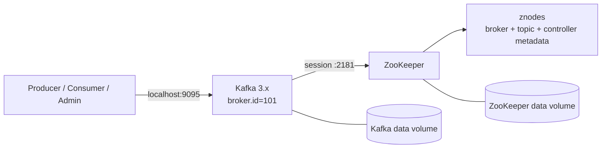

# Lab Apache Kafka độc lập bằng Docker Compose

Tài liệu này tách riêng phần thực hành Kafka khỏi project Kafka–Elasticsearch. Lab chính dựng cụm **3 Kafka broker kiêm KRaft controller**, có replication và quorum thật để thực hành topic, partition, consumer group, retention, replay, ISR và failover. Lab A14 bổ sung một stack Kafka–ZooKeeper legacy độc lập để học kiến trúc cũ và so sánh với KRaft.

> Phạm vi: môi trường học tập chạy Docker Compose trên một máy. Các listener dùng `PLAINTEXT`, không có authentication/TLS; chỉ bind cổng host vào `127.0.0.1` và không mở ra Internet.

## 1. Yêu cầu

- Docker Engine hoặc Docker Desktop đang chạy.
- Docker Compose plugin, kiểm tra bằng `docker compose version`.
- Tối thiểu 4 GB RAM trống cho riêng lab Kafka.
- Các cổng `9092`, `9093`, `9094` trên host chưa bị chiếm. Lab ZooKeeper tùy chọn còn dùng `2181` và `9095`.
- Chạy lệnh tại thư mục `kafka-elasticsearch-lab`.

Kiểm tra nhanh:

```bash
docker --version
docker compose version
docker info --format '{{.ServerVersion}}'
```

Lab dùng file Compose riêng, không dùng `docker-compose.yml` của project tích hợp. Nhờ vậy các container, network và named volume của hai luồng không bị trộn với nhau.

> File Compose tổng vẫn có service `kafka-init` để bootstrap topic cho **project tích hợp**. File lab không có service đó; người học tự tạo, mô tả và xóa topic bằng Kafka CLI.

## 2. Docker Compose của lab Kafka

Cấu hình đã được tách riêng tại [docker-compose.kafka.yml](./docker-compose.kafka.yml). File này chỉ chứa ba broker KRaft, job cấp quyền volume và profile Kafka–ZooKeeper legacy; không có API, indexer, Elasticsearch, web hoặc `kafka-init`.

Kiểm tra cấu hình trước khi chạy:

```bash
docker compose -f docker-compose.kafka.yml config --quiet
docker compose -f docker-compose.kafka.yml config
```

Mọi lệnh A0–A14 đều chỉ định `-f docker-compose.kafka.yml` để dùng đúng project `kafka-lab` và bộ volume độc lập với project tích hợp.

## 3. Giải thích cấu hình

### 3.1. Sơ đồ kiến trúc hiện tại



`kafka1`, `kafka2`, `kafka3` đều có hai vai trò. Vai trò **controller** tham gia biểu quyết metadata KRaft; vai trò **broker** nhận produce/fetch và lưu replica partition. Với RF=3, mỗi partition có mặt trên cả ba broker nhưng chỉ một replica là leader tại một thời điểm. Leader trên hình là quan hệ logic; Kafka có thể bầu lại leader khi broker dừng.

### 3.2. Ba loại listener

| Listener | Bind bên trong container | Địa chỉ quảng bá | Đối tượng sử dụng | Mục đích |
|---|---|---|---|---|
| `CONTROLLER` | `:29093` | Không quảng bá cho client | Ba KRaft controller | Trao đổi metadata, bầu controller leader và duy trì quorum. |
| `INTERNAL` | `:19092` | `kafka1:19092`, `kafka2:19092`, `kafka3:19092` | Broker và container cùng Compose network | Inter-broker traffic và client nội bộ dùng DNS service Docker. |
| `HOST` | `:9092` trong từng container | `localhost:9092`, `localhost:9093`, `localhost:9094` | Client chạy trên máy host | Cho phép công cụ hoặc ứng dụng ngoài Docker truy cập đúng broker. |

Port mapping của `kafka2` là `9093:9092` và `kafka3` là `9094:9092`: bên trong mỗi container vẫn nghe cổng `9092`, chỉ cổng phía host khác nhau. Không đổi riêng `ports` mà quên sửa `KAFKA_ADVERTISED_LISTENERS`; bootstrap có thể thành công nhưng client sẽ lỗi khi kết nối địa chỉ lấy từ metadata.

### 3.3. Setting Kafka/KRaft

| Setting | Giá trị hiện tại | Giải thích và mục đích |
|---|---|---|
| `KAFKA_PROCESS_ROLES` | `broker,controller` | Chạy combined mode để ba container vừa xử lý dữ liệu vừa tạo quorum metadata; giảm số container cho lab. |
| `KAFKA_NODE_ID` | `1`, `2`, `3` | ID duy nhất và ổn định của node; phải trùng ID khai báo trong danh sách voter. |
| `KAFKA_CONTROLLER_QUORUM_VOTERS` | `1@kafka1:29093,...` | Danh sách ba controller có quyền biểu quyết. Quorum cần đa số 2/3 nên chịu được mất một controller. |
| `CLUSTER_ID` | `MkU3OEVBNTcwNTJENDM2Qk` | ID định danh duy nhất của KRaft cluster, dùng khi format storage. Các node của cùng cluster phải dùng cùng ID. |
| `KAFKA_LISTENER_SECURITY_PROTOCOL_MAP` | Ba listener đều `PLAINTEXT` | Ánh xạ tên listener sang protocol. Dễ làm lab nhưng không mã hóa và không xác thực. |
| `KAFKA_INTER_BROKER_LISTENER_NAME` | `INTERNAL` | Buộc replication và giao tiếp broker đi qua mạng Docker thay vì vòng qua cổng host. |
| `KAFKA_CONTROLLER_LISTENER_NAMES` | `CONTROLLER` | Tách traffic controller khỏi listener dữ liệu của broker. |
| `KAFKA_OFFSETS_TOPIC_REPLICATION_FACTOR` | `3` | Internal topic lưu committed offset của consumer group có ba replica. |
| `KAFKA_MIN_INSYNC_REPLICAS` | `2` | Ngưỡng mặc định cho ghi `acks=all`: còn hai ISR thì ghi được, chỉ còn một thì từ chối để bảo vệ dữ liệu. |
| `KAFKA_AUTO_CREATE_TOPICS_ENABLE` | `false` | Ngăn tự tạo topic do gõ sai tên hoặc cấu hình client sai; trong lab người học phải chủ động dùng `kafka-topics.sh --create`. |
| `KAFKA_LOG_RETENTION_CHECK_INTERVAL_MS` | `10000` | Broker quét segment hết hạn mỗi 10 giây để các bài retention quan sát được nhanh. Đây là giá trị thiên về lab. |
| `KAFKA_LOG_DIRS` | `/tmp/kraft-combined-logs` | Nơi lưu metadata KRaft và partition log; được mount vào named volume để container bị tạo lại không làm mất log. |

### 3.4. Setting Docker Compose và healthcheck

| Setting | Giá trị | Giải thích và mục đích |
|---|---|---|
| `name` | `kafka-lab` | Đặt project name, làm tiền tố cho network/container/volume do Compose quản lý. |
| `x-kafka-common` và YAML anchor | `&kafka-common`, `&kafka-environment` | Gom cấu hình dùng chung; `<<: *...` merge vào từng broker để tránh ba khối bị lệch nhau. |
| `image` | `apache/kafka:${KAFKA_VERSION:-4.3.1}` | Dùng biến môi trường nếu có, nếu không dùng bản mặc định `4.3.1` để lab lặp lại được. |
| `restart` | `unless-stopped` | Docker tự khởi động lại broker khi process lỗi hoặc daemon restart, trừ khi người dùng chủ động stop. |
| `working_dir` | `/opt/kafka/bin` | Cho phép gọi CLI ngắn như `./kafka-topics.sh` thay vì ghi `/opt/kafka/bin/...`. |
| `hostname` | `kafka1`, `kafka2`, `kafka3` | Cung cấp hostname ổn định và trùng tên được quảng bá qua listener nội bộ. |
| `ports` | Bind `127.0.0.1` | Chỉ cho host cục bộ truy cập; tránh vô tình công khai Kafka `PLAINTEXT` ra LAN/Internet. |
| `volumes` | Một named volume mỗi broker | Cô lập log của từng node và cho phép mô phỏng node dừng/khôi phục độc lập. |
| `kafka-setup` | Job root chạy `chown 1000:1000` | Named volume mới mặc định thuộc root; job trao quyền ghi cho `appuser` UID 1000 của image Kafka rồi exit 0. |
| `healthcheck.test` | `kafka-broker-api-versions.sh` | Broker chỉ healthy khi Kafka API thực sự phản hồi, không chỉ khi process/container đang chạy. |
| `interval` / `timeout` | `10s` / `10s` | Cứ 10 giây kiểm tra một lần; mỗi lần được chờ tối đa 10 giây. |
| `retries` / `start_period` | `18` / `30s` | Cho Kafka tối đa khoảng ba phút sau giai đoạn khởi động để bầu quorum và trở nên healthy. |

### 3.5. Tham số tạo topic

| Tham số | Giá trị | Ý nghĩa |
|---|---|---|
| `--bootstrap-server` | `kafka1:19092` | Chỉ cần một broker ban đầu để lấy metadata. Bài failover dùng `kafka2` khi `kafka1` đang dừng. |
| `--create` / `--if-not-exists` | Tạo topic / bỏ qua nếu đã tồn tại | Lab dùng `--create` để quan sát cả kết quả thành công lẫn lỗi tạo trùng. `--if-not-exists` hữu ích cho script automation nhưng có thể che mất bài học này. |
| `--partitions` | `6` cho `kafka-feature-lab` | Quyết định mức song song tối đa của một consumer group và đơn vị đảm bảo thứ tự. |
| `--replication-factor` | `3` | Mỗi partition có ba bản sao trên ba broker. RF gồm cả leader, không phải ba follower cộng leader. |
| `min.insync.replicas` | `2` | Kết hợp `acks=all` để chấp nhận mất một broker nhưng không ghi khi chỉ còn một bản đồng bộ. |
| `unclean.leader.election.enable` | `false` | Không bầu replica ngoài ISR làm leader; ưu tiên tránh mất dữ liệu hơn availability. |
| `retention.ms` | `604800000` ms | Giữ record 7 ngày để có thể replay; bài A6 dùng giá trị ngắn hơn để quan sát cleanup. |

### 3.6. Profile ZooKeeper tương thích

Kafka 4.x đã loại bỏ ZooKeeper mode, nên không thể bật ZooKeeper cho ba broker KRaft hiện tại. Hai service tùy chọn dùng image Confluent Platform `7.7.1` (Kafka thế hệ 3.x) và chỉ chạy khi truyền `--profile zookeeper`.

| Setting | Giá trị | Mục đích |
|---|---|---|
| `profiles: ["zookeeper"]` | Tắt mặc định | `docker compose -f docker-compose.kafka.yml up` thông thường không tải/chạy stack legacy. |
| `ZOOKEEPER_CLIENT_PORT` | `2181` | Cổng client mà broker và ZooKeeper CLI sử dụng. |
| `ZOOKEEPER_TICK_TIME` | `2000` ms | Đơn vị thời gian cơ sở cho heartbeat, session timeout và cơ chế nội bộ ZooKeeper. |
| `ZOOKEEPER_SYNC_LIMIT` | `2` tick | Giới hạn độ trễ đồng bộ follower trong ensemble; lab một node vẫn giữ setting để minh họa. |
| `KAFKA_BROKER_ID` | `101` | ID broker duy nhất; xuất hiện dưới ephemeral znode `/brokers/ids/101`. |
| `KAFKA_ZOOKEEPER_CONNECT` | `zookeeper:2181` | Địa chỉ broker dùng để đăng ký và đọc/ghi metadata legacy. |
| Listener nội bộ / host | `zk-kafka:29095` / `localhost:9095` | Tách client trong Docker network khỏi client trên host, tránh đụng cổng cụm KRaft. |
| Internal topic RF/min ISR | `1` | Stack chỉ có một broker nên internal topic không thể dùng RF=3. Đây không phải cấu hình HA. |
| ZooKeeper/data volumes | Ba named volume riêng | Không trộn metadata/data của stack legacy với volume KRaft. |

## 4. Mục đích và tham số trọng tâm của từng lab

Lộ trình được sắp theo độ khó:

- **Lộ trình chính — A0 đến A7, A9 và A13:** topic, producer, Pub/Sub, consumer group, replay, retention, delivery semantics, failover và xử lý sự cố thường gặp.
- **Tùy chọn nâng cao — A8, A10 đến A12:** KRaft quorum, min ISR, thay đổi partition và log compaction.
- **Tùy chọn legacy — A14:** ZooKeeper, znode và broker registration của kiến trúc Kafka cũ.

| Lab | Mục đích | Setting/tham số trọng tâm | Kết quả cần chứng minh |
|---|---|---|---|
| A0 | Dựng cluster Kafka độc lập và hiểu vòng đời Compose. | `up -d`, healthcheck, named volume, bootstrap list. | Ba broker healthy và topic list ban đầu rỗng; dữ liệu vẫn còn sau khi recreate container không kèm `-v`. |
| A1 | Nắm mô hình dữ liệu và control plane Kafka. | Broker/controller, topic, partition, offset, record, RF, retention. | Phân biệt controller leader với partition leader và giải thích offset chỉ có nghĩa trong một partition. |
| A2 | Quan sát partition, replica, leader và ISR. | `--describe`, `--partitions 6`, `--replication-factor 3`, `min.insync.replicas=2`. | Topic có 6 partition, mỗi partition ba replica; RF=4 thất bại vì chỉ có ba broker. |
| A3 | Chứng minh key quyết định partition và phạm vi đảm bảo thứ tự. | `parse.key`, `key.separator`, `print.partition`, `print.offset`. | Cùng key vào cùng partition; offset tăng riêng; chỉ có ordering trong từng partition. |
| A4 | Thực hành Pub/Sub và phân biệt subscriber với worker. | Hai group độc lập, nhiều member cùng group, committed offset, lag và rebalance. | Mỗi group nhận đủ event; các member trong cùng group chia partition và không xử lý trùng một record tại cùng thời điểm. |
| A5 | Hiểu committed offset và replay có kiểm soát. | `--reset-offsets`, `--to-earliest`, `--dry-run`, `--execute`. | Group đọc lại record cũ mà record/offset trong log không bị copy hay đánh số lại; group khác không đổi. |
| A6 | Quan sát retention theo segment và tính append-only. | `cleanup.policy=delete`, `retention.ms=30000`, `segment.ms=10000`, `file.delete.delay.ms=1000`, earliest/latest. | Earliest offset tiến lên sau cleanup; consumer đọc xong không làm message bị xóa. |
| A7 | Phân tích delivery semantics của pipeline. | `acks=all`, idempotent producer, `autoCommit=false`, `_id=event.id`, DLQ. | Kết luận đúng là at-least-once cộng idempotent sink, không phải exactly-once xuyên Kafka–Elasticsearch. |
| A8 | Quan sát control plane KRaft và replication metadata. | `kafka-metadata-quorum describe --status/--replication`, `LeaderId`, `HighWatermark`, `Lag`. | Xác định controller leader, đủ ba voter và độ trễ metadata follower. |
| A9 | Mô phỏng mất một broker và quá trình tự phục hồi. | `docker compose -f docker-compose.kafka.yml stop/start`, leader election, ISR, RF=3, min ISR=2. | Cluster vẫn produce/consume với hai broker; leader chuyển; broker trở lại và bắt kịp ISR. |
| A10 | Thấy quan hệ giữa durability và availability khi ghi. | `acks=all`, đổi `min.insync.replicas=3`, `request.timeout.ms`, `delivery.timeout.ms`. | Producer bị từ chối khi chỉ còn hai ISR nhưng policy yêu cầu ba; ghi lại được sau khi khôi phục. |
| A11 | Đánh giá tác động của việc tăng partition. | `--alter --partitions 9`; thử giảm về `6`; hash key theo tổng partition. | Kafka cho tăng, không cho giảm; record mới cùng key có thể chuyển partition sau khi tăng. |
| A12 | Hiểu log compaction và tombstone. | `cleanup.policy=compact`, compaction lag, `min.cleanable.dirty.ratio`, `null.marker`, `delete.retention.ms`. | Cuối cùng giữ value mới nhất theo key; tombstone biểu diễn xóa; offset có khoảng trống và cleanup là eventual. |
| A13 | Hình thành quy trình chẩn đoán và dọn dữ liệu lab. | Listener, ISR, group lag, retention, `--delete --topic`. | Ánh xạ triệu chứng đến kiểm tra đầu tiên; xóa đúng topic thử nghiệm mà không xóa nhầm toàn bộ volume. |
| A14 | Hiểu kiến trúc Kafka dùng ZooKeeper trước KRaft. | Znode, session, ephemeral node, watcher, broker registration, topic metadata. | Quan sát broker ID/topic trong ZooKeeper và thấy control-plane operation lỗi khi ZooKeeper dừng. |

### 4.1. Tham số CLI dùng lặp lại

| Tham số | Tác dụng |
|---|---|
| `--bootstrap-server` | Điểm vào ban đầu để client lấy metadata cluster; không phải mọi request đều đi qua broker đầu tiên. |
| `--topic` / `--group` | Chọn topic thao tác và định danh consumer group có committed offset riêng. |
| `--describe` | Chỉ đọc metadata/cấu hình/trạng thái, phù hợp kiểm tra trước và sau mỗi thay đổi. |
| `--from-beginning` | Consumer không có committed offset bắt đầu từ earliest; không tự reset một group đã commit. |
| `--formatter-property` | Chỉ thay cách CLI hiển thị key, partition, offset; không sửa record. |
| `--reader-property` | Chỉ cách console producer phân tách key/value và diễn giải null marker. |
| `--command-property` | Truyền setting xuống producer client, ví dụ `acks`, idempotence và timeout. |
| `--dry-run` / `--execute` | Xem trước rồi mới áp dụng reset offset, giảm rủi ro replay nhầm. |
| `--time earliest/latest` | Lấy offset đầu/cuối hiện còn trong log để quan sát retention và backlog. |
| `--timeout-ms` / `--max-messages` | Giới hạn thời gian hoặc số record để console consumer tự thoát trong bài lab. |

---

## A0. Khởi động lab Kafka độc lập

> **Mục đích:** Xác nhận hạ tầng 3 node khởi động đúng thứ tự và quorum hình thành trước khi tự thao tác Kafka CLI. **Trọng tâm:** healthcheck, bootstrap server và named volume.

Phần A không cần Elasticsearch, API, indexer, web hoặc `kafka-init`. Chỉ khởi động ba broker/controller:

```bash
docker compose -f docker-compose.kafka.yml up -d kafka1 kafka2 kafka3
docker compose -f docker-compose.kafka.yml ps -a kafka-setup kafka1 kafka2 kafka3
```

**Giải thích lệnh:** `-f` chọn đúng Compose dành cho Kafka; `up -d` tạo và chạy container ở background; danh sách ba service tránh khởi động ZooKeeper; `ps -a` hiển thị cả job `kafka-setup` đã chạy xong với trạng thái `Exited (0)`.

> **Nếu đã tạo container trước khi tài liệu thêm `working_dir`:** `docker compose up` không tự tạo lại container chỉ vì file Compose vừa thay đổi ở một số môi trường. Chạy một lần:
>
> ```bash
> docker compose -f docker-compose.kafka.yml up -d --force-recreate kafka1 kafka2 kafka3
> docker compose -f docker-compose.kafka.yml exec kafka1 pwd
> ```
>
> `pwd` phải trả `/opt/kafka/bin`. `--force-recreate` chỉ tạo lại container, không xóa named volume hay dữ liệu Kafka. Nếu vẫn thấy thư mục khác, kiểm tra đang chạy đúng file bằng `docker compose -f docker-compose.kafka.yml config | grep working_dir`.

Ba broker dùng chung KRaft quorum nhưng mỗi broker có named volume riêng. Các lệnh CLI chạy từ `kafka1` và dùng broker này làm điểm bootstrap. Kafka sẽ trả metadata của toàn cluster sau kết nối đầu tiên; riêng bài failover dùng `kafka2` khi `kafka1` đang dừng.

Các lệnh Compose thông dụng trong toàn bộ lab:

| Lệnh | Dùng khi nào |
|---|---|
| `docker compose -f docker-compose.kafka.yml ps` | Xem container đang chạy, health, exit code và port mapping. |
| `docker compose -f docker-compose.kafka.yml logs -f kafka1` | Theo dõi log broker; `Ctrl+C` chỉ thoát xem log, không dừng container. |
| `docker compose -f docker-compose.kafka.yml exec kafka1 <lệnh>` | Chạy Kafka CLI trong container đang hoạt động. |
| `docker compose -f docker-compose.kafka.yml stop kafka1` / `start kafka1` | Mô phỏng broker dừng rồi phục hồi mà không xóa container hoặc volume. |
| `docker compose -f docker-compose.kafka.yml restart kafka1` | Restart nhanh cùng container; phù hợp thử lỗi process, không mô phỏng tạo lại node. |
| `docker compose -f docker-compose.kafka.yml config` | Xem cấu hình cuối sau khi Compose merge anchor và nội suy biến môi trường. |
| `docker compose -f docker-compose.kafka.yml down` | Xóa container/network nhưng giữ named volume. |
| `docker compose -f docker-compose.kafka.yml down -v` | Xóa cả volume và toàn bộ log; chỉ dùng khi muốn làm lại từ đầu. |

Kiểm tra topic trước khi tự tạo:

```bash
docker compose -f docker-compose.kafka.yml exec kafka1 ./kafka-topics.sh \
  --bootstrap-server kafka1:19092 --list
```

> ✅ **Đầu ra dự kiến:** `kafka1`, `kafka2`, `kafka3` ở trạng thái `healthy`; `kafka-setup` là `Exited (0)`. Nếu dùng volume mới, lệnh `--list` không in topic nghiệp vụ nào.
>
> **Tại sao:** healthcheck chỉ thành công sau khi broker trả lời Kafka API. `KAFKA_AUTO_CREATE_TOPICS_ENABLE=false` nên cluster không âm thầm tạo topic; topic sẽ được tự tạo bằng CLI ở A2. Nếu topic cũ vẫn xuất hiện, dữ liệu đang được giữ trong named volume từ lần lab trước.

> 📸 **BÁO CÁO A0:** Chụp ba broker healthy và kết quả topic list. Ghi node ID, host port và volume của từng broker từ `docker compose -f docker-compose.kafka.yml config`.

## A1. Kiến thức nền

> **Mục đích:** Xây dựng mô hình tư duy trước khi chạy lệnh: dữ liệu nằm trong partition log, còn KRaft controller quản lý metadata. **Trọng tâm:** broker, controller, topic, partition, record, offset, consumer group, retention và replication factor.

Kafka là nền tảng event streaming phân tán. Producer append record vào topic; consumer tự đọc record theo offset. Khác queue xóa message sau khi nhận, Kafka giữ record theo retention nên nhiều consumer group có thể đọc độc lập và có thể replay.

| Khái niệm | Ý nghĩa trong lab |
|---|---|
| Broker | Ba server `kafka1`, `kafka2`, `kafka3` lưu log partition |
| KRaft controller | Ba controller tạo quorum; mỗi container chạy combined `broker,controller` |
| Topic | Luồng logic; trong lab sẽ tự tạo `kafka-feature-lab` |
| Partition | Sáu log append-only; đơn vị song song và thứ tự |
| Record | Key, value, timestamp, headers và offset |
| Offset | Vị trí tăng dần, chỉ có nghĩa bên trong một partition |
| Producer | API hoặc console producer ghi record |
| Consumer group | `demo-workers`; mỗi partition chỉ giao cho một member trong group |
| Retention | `kafka-feature-lab` được cấu hình giữ record 7 ngày |
| Replication factor | Topic chính dùng RF=3: leader và hai follower trên ba broker |

KRaft dùng quorum controller và metadata log thay cho ZooKeeper. Lab có quorum thật 3 controller, chịu được mất 1 controller. Combined mode (`broker,controller`) phù hợp lab và cluster nhỏ; hệ thống lớn thường tách controller khỏi broker để cô lập tải.

> ✅ **Đầu ra dự kiến:** Sau A1, bạn phải tự giải thích được chuỗi `topic → partition → record → offset`, và phân biệt replication dữ liệu với quorum metadata.
>
> **Tại sao:** đây là hai luồng độc lập: controller quyết định metadata/leadership; broker leader của từng partition phục vụ produce/fetch.

## A2. Lab topic, partition và replication factor

> **Mục đích:** Đọc được metadata topic và phân biệt leader, replica với ISR. **Trọng tâm:** `--describe`, `--partitions`, `--replication-factor`, `min.insync.replicas` và giới hạn RF theo số broker.

Liệt kê topic để xác nhận trạng thái hiện tại:

```bash
docker compose -f docker-compose.kafka.yml exec kafka1 ./kafka-topics.sh \
  --bootstrap-server kafka1:19092 --list
```

Tự tạo topic dùng xuyên suốt các lab Kafka:

```bash
docker compose -f docker-compose.kafka.yml exec kafka1 ./kafka-topics.sh \
  --bootstrap-server kafka1:19092 \
  --create --topic kafka-feature-lab \
  --partitions 6 --replication-factor 3 \
  --config min.insync.replicas=2 \
  --config unclean.leader.election.enable=false \
  --config retention.ms=604800000
```

**Giải thích lệnh:**

- `exec kafka1`: chạy Kafka CLI bên trong broker `kafka1`; không tạo container mới.
- `--bootstrap-server`: broker đầu tiên để CLI lấy metadata cluster, không có nghĩa mọi request luôn đi qua `kafka1`.
- `--partitions 6`: tạo sáu log độc lập, cho phép tối đa sáu consumer cùng group có partition để xử lý.
- `--replication-factor 3`: mỗi partition có tổng cộng ba bản, gồm một leader và hai follower.
- `min.insync.replicas=2`: ghi `acks=all` cần ít nhất hai replica đang đồng bộ.
- `unclean.leader.election.enable=false`: không bầu replica đã tụt khỏi ISR làm leader vì có nguy cơ mất dữ liệu.
- `retention.ms=604800000`: giữ record trong bảy ngày trước khi đủ điều kiện cleanup.

Mô tả topic vừa tạo:

```bash
docker compose -f docker-compose.kafka.yml exec kafka1 ./kafka-topics.sh \
  --bootstrap-server kafka1:19092 \
  --describe --topic kafka-feature-lab
```

Cần thấy `PartitionCount: 6`, `ReplicationFactor: 3`, `min.insync.replicas=2` và partition `0–5`. Mỗi dòng có ba `Replicas`; khi cluster khỏe, `Isr` cũng có ba broker. `Leader: 1` nghĩa broker node ID 1 đang làm leader, không phải partition 1.

Thử yêu cầu RF lớn hơn số broker:

```bash
docker compose -f docker-compose.kafka.yml exec kafka1 ./kafka-topics.sh \
  --bootstrap-server kafka1:19092 \
  --create --topic should-fail \
  --partitions 1 --replication-factor 4
```

Lệnh cuối phải thất bại vì cluster chỉ có ba broker. Replica của cùng partition luôn được đặt trên broker khác nhau; RF=3 tạo ba bản dữ liệu chứ không phải “ba replica cộng thêm leader”.

> ✅ **Đầu ra dự kiến:** Phần đầu của `--describe` có dạng `PartitionCount: 6`, `ReplicationFactor: 3`; mỗi partition có một `Leader`, ba `Replicas` và khi khỏe có ba ID trong `Isr`. Lệnh RF=4 báo lỗi kiểu `Replication factor: 4 larger than available brokers: 3`.
>
> **Tại sao:** một broker không thể giữ hai replica của cùng partition; với ba broker, RF tối đa của topic là 3. ID leader có thể khác giữa các lần chạy nên không đối chiếu cứng với một con số.

> 📸 **BÁO CÁO A2:** Chụp describe thể hiện 6 partition, RF=3 và ISR đủ ba broker; chụp lỗi RF=4. Phân biệt leader, replica và ISR.

## A3. Lab producer, key, partition, offset và thứ tự

> **Mục đích:** Chứng minh key quyết định nơi record được ghi và Kafka chỉ đảm bảo thứ tự trong một partition. **Trọng tâm:** `parse.key`, `key.separator`, `print.partition` và `print.offset`.

Mở Terminal 1, chạy consumer in key, partition, offset:

```bash
docker compose -f docker-compose.kafka.yml exec kafka1 ./kafka-console-consumer.sh \
  --bootstrap-server kafka1:19092 \
  --topic kafka-feature-lab \
  --from-beginning \
  --formatter-property print.key=true \
  --formatter-property print.partition=true \
  --formatter-property print.offset=true
```

Mở Terminal 2, chạy producer nhận `key:value`:

```bash
docker compose -f docker-compose.kafka.yml exec -it kafka1 ./kafka-console-producer.sh \
  --bootstrap-server kafka1:19092 \
  --topic kafka-feature-lab \
  --reader-property parse.key=true \
  --reader-property key.separator=:
```

**Giải thích lệnh:**

- `-it`: giữ terminal tương tác để nhập từng record; thoát bằng `Ctrl+C`.
- `parse.key=true`: yêu cầu producer tách mỗi dòng thành key và value.
- `key.separator=:`: phần trước dấu `:` là key, phần sau là value.
- Các `print.*` ở consumer chỉ thay đổi cách hiển thị để quan sát; chúng không sửa record trong Kafka.

Nhập lần lượt:

```text
user-001:view-product-A
user-002:view-product-B
user-001:add-product-A-to-cart
user-003:purchase-product-C
user-001:purchase-product-A
```

Nhấn `Ctrl+C`. Quan sát:

- Các record có key `user-001` vào cùng partition.
- Offset tăng độc lập trong từng partition.
- Kafka đảm bảo thứ tự trong **một partition**, không đảm bảo thứ tự toàn topic.
- Không có key thì producer có thể phân phối batch theo partitioner; không nên dựa vào một thứ tự toàn cục.

> ✅ **Đầu ra dự kiến:** Consumer in partition, offset, key và value trên mỗi dòng, ví dụ `Partition:<n> Offset:<m> user-001 view-product-A`. Ba record `user-001` cùng partition và offset tăng dần trong partition đó; key khác có thể ở partition khác.
>
> **Tại sao:** producer hash key để chọn partition. Offset là vị trí append trong một partition, vì vậy Kafka chỉ bảo toàn thứ tự theo partition.

> 📸 **BÁO CÁO A3:** Chụp producer và consumer, đánh dấu ba record `user-001`, partition và offset. Giải thích vì sao chọn `userId` làm key trong project.

## A4. Lab Pub/Sub, consumer group và phân phối tải

> **Mục đích:** Chứng minh Kafka fan-out event theo **consumer group**, đồng thời chia tải giữa các consumer trong cùng group. **Trọng tâm:** topic, subscriber group, worker cùng group, committed offset, lag và rebalance.

### A4.1. Mô hình cần quan sát



- `notifications` và `analytics` là hai subscriber độc lập: mỗi group có offset riêng và đều nhận toàn bộ event.
- `Worker 1` và `Worker 2` cùng `demo-workers`: Kafka chia partition cho hai worker; một record chỉ do một member trong group xử lý tại một thời điểm.
- Kafka fan-out đến **group**, không gửi một bản riêng cho từng consumer nằm trong cùng group.

Tạo topic riêng để kết quả không lẫn record từ A3:

```bash
docker compose -f docker-compose.kafka.yml exec kafka1 ./kafka-topics.sh \
  --bootstrap-server kafka1:19092 \
  --create --topic pubsub-lab \
  --partitions 3 --replication-factor 3
```

Gửi sáu event với ba key. Với topic ba partition, ba key này được chọn để rơi vào ba partition khác nhau trong Kafka Java partitioner:

```bash
printf 'order-06:created-A\norder-05:created-B\norder-01:created-C\norder-06:paid-A\norder-05:paid-B\norder-01:paid-C\n' \
  | docker compose -f docker-compose.kafka.yml exec -T kafka1 \
      ./kafka-console-producer.sh \
      --bootstrap-server kafka1:19092 \
      --topic pubsub-lab \
      --reader-property parse.key=true \
      --reader-property key.separator=:
```

**Giải thích lệnh producer:** `printf` tạo sáu dòng input; toán tử `|` chuyển chúng vào standard input của producer; `exec -T` tắt pseudo-TTY để pipe hoạt động ổn định. `parse.key=true` và dấu `:` tách key khỏi value. Cùng key luôn vào cùng partition; ba key đã chọn tạo hai record trên mỗi partition, giúp dễ quan sát hai worker chia tải.

> Nếu gửi record **không có key**, producer có thể gom cả batch vào một partition. Khi đó toàn bộ năm hoặc sáu order xuất hiện ở một worker là đúng: Kafka chia partition cho worker, không chia luân phiên từng message.

### A4.2. Hai subscriber đều nhận đủ event

Đọc bằng subscriber `notifications`:

```bash
docker compose -f docker-compose.kafka.yml exec kafka1 \
  ./kafka-console-consumer.sh \
  --bootstrap-server kafka1:19092 \
  --topic pubsub-lab --group notifications \
  --from-beginning --max-messages 6
```

**Giải thích lệnh subscriber:** `--group notifications` tạo con trỏ offset riêng cho subscriber này; `--from-beginning` đọc từ earliest khi group chưa từng commit; `--max-messages 6` tự thoát sau sáu record để lab không phải dừng thủ công.

Chạy lại với subscriber khác:

```bash
docker compose -f docker-compose.kafka.yml exec kafka1 \
  ./kafka-console-consumer.sh \
  --bootstrap-server kafka1:19092 \
  --topic pubsub-lab --group analytics \
  --from-beginning --max-messages 6
```

`--from-beginning` chỉ áp dụng khi group chưa có committed offset. `--max-messages 6` giúp CLI tự thoát sau khi nhận đủ sáu record.

> ✅ **Đầu ra dự kiến:** Cả `notifications` và `analytics` đều in đủ sáu event, dù thứ tự giữa các partition có thể khác.
>
> **Tại sao:** mỗi group lưu committed offset riêng. Việc `notifications` đọc và commit không làm offset của `analytics` thay đổi và không xóa record khỏi topic.

### A4.3. Hai worker cùng group chia tải

Mở Terminal 1 và Terminal 2, chạy cùng lệnh sau trên cả hai terminal rồi giữ chúng hoạt động:

```bash
docker compose -f docker-compose.kafka.yml exec kafka1 \
  ./kafka-console-consumer.sh \
  --bootstrap-server kafka1:19092 \
  --topic pubsub-lab --group demo-workers
```

Chờ vài giây để hai worker join group, rồi ở Terminal 3 gửi thêm event bằng producer ở A4.1. Quan sát hai terminal consumer và kiểm tra assignment:

```bash
docker compose -f docker-compose.kafka.yml exec kafka1 \
  ./kafka-consumer-groups.sh \
  --bootstrap-server kafka1:19092 \
  --describe --group demo-workers
```

**Giải thích lệnh worker:** hai terminal dùng cùng `--group demo-workers` nên Kafka chia partition giữa chúng. `--describe` chỉ đọc trạng thái assignment, offset và lag; không làm consumer group rebalance hay đổi offset.

Các cột thường dùng:

- `CURRENT-OFFSET`: offset kế tiếp group sẽ đọc.
- `LOG-END-OFFSET`: vị trí cuối log hiện tại.
- `LAG = LOG-END-OFFSET - CURRENT-OFFSET`: số record group chưa xử lý.
- `CONSUMER-ID`: member đang giữ partition.

Dừng một worker bằng `Ctrl+C`; sau vài giây worker còn lại nhận các partition qua rebalance. Với ba partition, tối đa ba worker có việc; worker thứ tư sẽ không được gán partition.

> ✅ **Đầu ra dự kiến:** Hai worker nhận các phần event khác nhau; bảng group có ba partition được chia giữa hai `CONSUMER-ID`. Với hai record trên mỗi partition, hai worker thường chia `4/2` vì một worker giữ hai partition và worker kia giữ một. Khi một worker dừng, worker còn lại giữ cả ba partition và `LAG` dần về `0`.
>
> **Tại sao:** trong cùng group, một partition chỉ được gán cho một member tại một thời điểm. Membership thay đổi khiến group coordinator chạy rebalance.

> 📸 **BÁO CÁO A4:** Chụp `notifications` và `analytics` đều nhận sáu event; chụp hai `demo-workers` chia partition trước/sau khi dừng một member. Kết luận: khác group là Pub/Sub, cùng group là load balancing.

## A5. Lab commit offset và replay

> **Mục đích:** Phân biệt record offset trong log với committed offset của consumer group và thực hiện replay an toàn. **Trọng tâm:** `--reset-offsets`, `--to-earliest`, `--dry-run` trước `--execute`.

Dừng toàn bộ consumer thuộc `demo-workers`, kiểm tra group ở trạng thái không active rồi reset về đầu:

```bash
docker compose -f docker-compose.kafka.yml exec kafka1 ./kafka-consumer-groups.sh \
  --bootstrap-server kafka1:19092 \
  --group demo-workers --topic pubsub-lab \
  --reset-offsets --to-earliest --dry-run

docker compose -f docker-compose.kafka.yml exec kafka1 ./kafka-consumer-groups.sh \
  --bootstrap-server kafka1:19092 \
  --group demo-workers --topic pubsub-lab \
  --reset-offsets --to-earliest --execute
```

**Giải thích lệnh:**

- `--group` và `--topic`: giới hạn đúng con trỏ cần thay đổi, không ảnh hưởng group khác.
- `--reset-offsets`: chuyển committed offset; không sửa hoặc nhân bản record trong partition log.
- `--to-earliest`: đặt mỗi partition về offset sớm nhất hiện còn sau retention.
- `--dry-run`: chỉ xem trước kết quả, nên luôn chạy trước.
- `--execute`: áp dụng thay đổi thật; group phải không còn consumer active.

Chạy lại consumer cùng group, record cũ xuất hiện lại:

```bash
docker compose -f docker-compose.kafka.yml exec kafka1 ./kafka-console-consumer.sh \
  --bootstrap-server kafka1:19092 \
  --topic pubsub-lab --group demo-workers \
  --formatter-property print.partition=true --formatter-property print.offset=true
```

Replay không copy record và không đổi offset của record; nó đổi committed offset của group. Group khác không bị ảnh hưởng.

> ✅ **Đầu ra dự kiến:** `--dry-run` hiển thị offset hiện tại và offset đề xuất; `--execute` đưa offset của `demo-workers` về đầu. Consumer cùng group đọc lại record cũ.
>
> **Tại sao:** Kafka giữ record theo retention, độc lập với committed offset. Reset chỉ di chuyển con trỏ của một group chứ không sửa partition log.

> 📸 **BÁO CÁO A5:** Chụp dry-run, execute và các record được đọc lại. Ghi hai trường hợp thực tế cần replay.

## A6. Lab retention và log bất biến

> **Mục đích:** Chứng minh consumer không xóa message và Kafka dọn dữ liệu hết hạn theo segment ở background. **Trọng tâm:** `cleanup.policy=delete`, `retention.ms`, `segment.ms`, `file.delete.delay.ms`, earliest/latest offset.

Xem cấu hình topic của lab:

```bash
docker compose -f docker-compose.kafka.yml exec kafka1 ./kafka-configs.sh \
  --bootstrap-server kafka1:19092 \
  --entity-type topics --entity-name kafka-feature-lab --describe
```

`retention.ms=604800000` tương đương 7 ngày. Consumer đọc xong không xóa record. Broker chia partition log thành segment; tiến trình dọn dữ liệu xóa segment đã hết hạn, không xóa riêng từng message ngay khi consumer xử lý.

Thử trên topic riêng một partition để dễ quan sát. Topic vẫn có RF=3; Kafka xóa theo **segment**, vì vậy cần tạo segment mới và chờ background retention scan (`10s` trong Compose):

```bash
docker compose -f docker-compose.kafka.yml exec kafka1 ./kafka-topics.sh \
  --bootstrap-server kafka1:19092 \
  --create --if-not-exists --topic kafka-retention-lab \
  --partitions 1 --replication-factor 3 \
  --config cleanup.policy=delete \
  --config retention.ms=30000 \
  --config segment.ms=10000 \
  --config file.delete.delay.ms=1000

printf 'old-0\nold-1\n' \
  | docker compose -f docker-compose.kafka.yml exec -T kafka1 ./kafka-console-producer.sh \
      --bootstrap-server kafka1:19092 \
      --topic kafka-retention-lab

docker compose -f docker-compose.kafka.yml exec kafka1 ./kafka-get-offsets.sh \
  --bootstrap-server kafka1:19092 \
  --topic kafka-retention-lab --time earliest
docker compose -f docker-compose.kafka.yml exec kafka1 ./kafka-get-offsets.sh \
  --bootstrap-server kafka1:19092 \
  --topic kafka-retention-lab --time latest

sleep 12
printf 'retention-roll\n' \
  | docker compose -f docker-compose.kafka.yml exec -T kafka1 ./kafka-console-producer.sh \
      --bootstrap-server kafka1:19092 \
      --topic kafka-retention-lab
sleep 45

docker compose -f docker-compose.kafka.yml exec kafka1 ./kafka-get-offsets.sh \
  --bootstrap-server kafka1:19092 \
  --topic kafka-retention-lab --time earliest
```

**Giải thích lệnh:**

- `cleanup.policy=delete`: xóa segment khi quá thời gian hoặc dung lượng retention.
- `retention.ms=30000`: record đủ điều kiện hết hạn sau 30 giây; không bảo đảm bị xóa đúng giây thứ 30.
- `segment.ms=10000`: roll segment sớm để bài lab không phải chờ segment mặc định rất lâu.
- `file.delete.delay.ms=1000`: trì hoãn xóa file vật lý một giây sau khi Kafka đánh dấu segment.
- `--time earliest/latest`: đọc offset đầu tiên còn tồn tại và offset cuối log để so sánh trước/sau cleanup.
- `sleep`: chờ segment roll và background retention checker; đây là cơ chế bất đồng bộ nên kết quả có thể muộn hơn một chu kỳ.

Earliest offset có thể tiến lên và xuất hiện khoảng trống; offset không được đánh số lại. Thời gian vẫn là eventual vì retention scan chạy nền.

> ✅ **Đầu ra dự kiến:** Trước cleanup, earliest thường là `0`; sau khi segment cũ hết hạn, earliest tăng lên trong khi latest vẫn lớn hơn. Kết quả có thể chậm hơn tổng thời gian `sleep` vài chu kỳ quét.
>
> **Tại sao:** Kafka xóa cả segment đã đóng, không xóa từng record đúng tại mốc 30 giây. `segment.ms` tạo cơ hội roll segment và retention checker chạy bất đồng bộ mỗi 10 giây.

> 📸 **BÁO CÁO A6:** Chụp earliest/latest trước và earliest sau cleanup. Ghi khác biệt giữa retention theo thời gian, retention theo dung lượng và log compaction.

## A7. Delivery semantics trong project

> **Mục đích:** Phân tích ranh giới bảo đảm giao nhận khi Kafka tích hợp với hệ thống ngoài. **Trọng tâm:** `acks=all`, producer idempotence, manual commit, retry, DLQ và idempotent document ID.

API gửi với:

```text
acks = -1 (all in cách gọi KafkaJS)
idempotent producer = true
key = userId
```

Indexer dùng `autoCommit: false`; chỉ commit offset kế tiếp sau khi Elasticsearch ghi thành công. Các tình huống:

| Trình tự | Kết quả |
|---|---|
| Ghi ES thành công, commit thành công | Xử lý đúng một lần trong lần chạy đó |
| Ghi ES lỗi | Không commit; record được thử lại |
| Ghi ES thành công, process chết trước commit | Kafka giao lại; `_id=event.id` ngăn document trùng |
| JSON/schema sai | Đưa sang DLQ rồi commit để không chặn partition |

Đây là **at-least-once + idempotent sink**, không phải transaction exactly-once xuyên Kafka và Elasticsearch. Kafka transaction không thể tự biến thao tác HTTP đến Elasticsearch thành một transaction phân tán nguyên tử.

> ✅ **Đầu ra dự kiến:** Kết luận của bài phải là: record có thể được giao lại, nhưng cùng `event.id` chỉ tạo một document cuối cùng trong Elasticsearch; record sai dữ liệu đi DLQ, lỗi hạ tầng thì retry.
>
> **Tại sao:** crash giữa bước ghi Elasticsearch và commit Kafka tạo cửa sổ duplicate delivery. `_id` cố định biến lần ghi lại thành overwrite, còn manual commit ngăn mất record khi downstream lỗi.

## A8. Tùy chọn nâng cao: KRaft quorum và trạng thái replication

> **Mục đích:** Quan sát metadata quorum độc lập với data partition và đọc được tình trạng đồng bộ controller. **Trọng tâm:** `LeaderId`, `CurrentVoters`, `HighWatermark`, `LogEndOffset` và `Lag`.

Kiểm tra leader của metadata quorum và độ trễ follower:

```bash
docker compose -f docker-compose.kafka.yml exec kafka1 ./kafka-metadata-quorum.sh \
  --bootstrap-server kafka1:19092 \
  describe --status

docker compose -f docker-compose.kafka.yml exec kafka1 ./kafka-metadata-quorum.sh \
  --bootstrap-server kafka1:19092 \
  describe --replication
```

**Giải thích lệnh:** `describe --status` tóm tắt leader, epoch và danh sách voter; `describe --replication` đi sâu vào offset/lag của từng controller. Hai lệnh chỉ đọc metadata, không thay đổi quorum.

Đọc các trường `LeaderId`, `CurrentVoters`, `HighWatermark`, `LogEndOffset` và `Lag`. Controller leader quản lý metadata; partition leader quản lý read/write của một data partition. Đây là hai loại leader khác nhau.

> ✅ **Đầu ra dự kiến:** `describe --status` hiển thị một `LeaderId` và ba `CurrentVoters`; `describe --replication` có một leader cùng hai follower, `Lag` thường bằng 0 khi cluster rảnh.
>
> **Tại sao:** metadata log cũng được sao chép theo quorum. Follower đã bắt kịp high watermark sẽ không có lag; leader ID có thể thay đổi sau election.

> 📸 **BÁO CÁO A8:** Chụp quorum status và replication. Xác định controller leader hiện tại và chứng minh đủ ba voter.

## A9. Lab broker failure, leader election và ISR

> **Mục đích:** Kiểm chứng cluster tiếp tục phục vụ khi mất một broker và replica tự bắt kịp sau phục hồi. **Trọng tâm:** `stop/start`, partition leader election, `Replicas`, `Isr`, RF=3 và min ISR=2.

Mô tả topic trước sự cố:

```bash
docker compose -f docker-compose.kafka.yml exec kafka1 ./kafka-topics.sh \
  --bootstrap-server kafka1:19092 \
  --describe --topic kafka-feature-lab
```

> ✅ **Đầu ra dự kiến:** Khi `kafka1` dừng, `Replicas` vẫn có ba ID nhưng `Isr` chỉ còn hai; partition từng do node 1 dẫn đầu có leader mới. Produce với `acks=all` vẫn thành công. Sau khi start lại, ISR trở về ba ID.
>
> **Tại sao:** RF=3 còn hai bản đồng bộ, vừa đủ `min.insync.replicas=2`. Replica trên node 1 đọc phần log thiếu từ leader mới rồi mới được thêm lại vào ISR. Trong lúc node dừng, CLI có thể cảnh báo không resolve/kết nối được `kafka1`; đây là bình thường vì metadata vẫn liệt kê broker đã dừng. Consumer dùng `--timeout-ms` cũng có thể in `TimeoutException` sau khi đã đọc xong record cần kiểm tra.

Dừng một broker. Chọn `kafka1` vì các lệnh CLI sau có thể chạy từ `kafka2`:

```bash
docker compose -f docker-compose.kafka.yml stop kafka1
docker compose -f docker-compose.kafka.yml ps kafka1 kafka2 kafka3

docker compose -f docker-compose.kafka.yml exec kafka2 ./kafka-topics.sh \
  --bootstrap-server kafka2:19092 \
  --describe --topic kafka-feature-lab
```

**Giải thích lệnh:** `stop` chỉ dừng container và giữ volume, phù hợp mô phỏng broker chết có thể phục hồi. CLI được chuyển sang chạy trong `kafka2` vì không thể `exec` vào container `kafka1` đang dừng.

Quan sát:

- Partition từng có leader 1 được bầu leader mới từ ISR.
- `Replicas` vẫn liệt kê ba bản được phân công; `Isr` chỉ còn broker sống.
- Topic vẫn đọc/ghi vì còn 2 ISR, đúng `min.insync.replicas=2`.
- KRaft còn 2/3 voter nên metadata quorum vẫn hoạt động.

Gửi và đọc record khi một broker dừng:

```bash
printf 'event-while-kafka1-down\n' \
  | docker compose -f docker-compose.kafka.yml exec -T kafka2 ./kafka-console-producer.sh \
      --bootstrap-server kafka2:19092 \
      --topic kafka-feature-lab

docker compose -f docker-compose.kafka.yml exec kafka2 ./kafka-console-consumer.sh \
  --bootstrap-server kafka2:19092 \
  --topic kafka-feature-lab --from-beginning --timeout-ms 10000 \
  | grep 'event-while-kafka1-down'
```

**Giải thích lệnh:** `-T` tắt pseudo-TTY để nhận dữ liệu từ `printf`; `--timeout-ms 10000` tự thoát nếu 10 giây không có thêm record; `grep` chỉ lọc record kiểm chứng, không tác động Kafka.

Khôi phục broker và chờ nó bắt kịp ISR:

```bash
docker compose -f docker-compose.kafka.yml start kafka1
until docker compose -f docker-compose.kafka.yml exec -T kafka1 ./kafka-broker-api-versions.sh \
  --bootstrap-server kafka1:19092 >/dev/null 2>&1; do sleep 3; done
sleep 5

docker compose -f docker-compose.kafka.yml exec kafka1 ./kafka-topics.sh \
  --bootstrap-server kafka1:19092 \
  --describe --topic kafka-feature-lab
```

**Giải thích vòng `until`:** `docker compose start` chỉ cho biết container đã chạy, chưa bảo đảm Kafka API sẵn sàng. Vòng lặp thử API mỗi ba giây; mã thoát `0` mới kết thúc vòng chờ. `>/dev/null 2>&1` ẩn output của các lần thử thất bại.

> 📸 **BÁO CÁO A9:** Chụp leader/ISR trước, trong và sau sự cố; kèm record được produce khi `kafka1` dừng. Không dùng `docker compose -f docker-compose.kafka.yml down -v` trong bài vì sẽ xóa log cần recovery.

## A10. Tùy chọn nâng cao: `acks=all` và `min.insync.replicas`

> **Mục đích:** Thấy trực tiếp đánh đổi durability–availability của write policy. **Trọng tâm:** `acks=all`, thay đổi `min.insync.replicas`, `request.timeout.ms`, `delivery.timeout.ms` và lỗi `NotEnoughReplicas`.

Đây là cách chứng minh durability policy, không cần dừng hai controller làm mất quorum. Tạm nâng min ISR của topic lab lên 3:

```bash
docker compose -f docker-compose.kafka.yml exec kafka1 ./kafka-configs.sh \
  --bootstrap-server kafka1:19092 \
  --entity-type topics --entity-name kafka-feature-lab \
  --alter --add-config min.insync.replicas=3

docker compose -f docker-compose.kafka.yml stop kafka3
```

Producer yêu cầu tất cả ISR xác nhận sẽ thất bại vì chỉ còn hai ISR:

```bash
printf 'durability-user:must-fail\n' \
  | docker compose -f docker-compose.kafka.yml exec -T kafka1 ./kafka-console-producer.sh \
      --bootstrap-server kafka1:19092 \
      --topic kafka-feature-lab \
      --reader-property parse.key=true --reader-property key.separator=: \
      --command-property acks=all \
      --command-property request.timeout.ms=5000 \
      --command-property delivery.timeout.ms=10000
```

**Giải thích lệnh:**

- `--alter --add-config min.insync.replicas=3`: đổi riêng cấu hình topic, không đổi mặc định toàn broker.
- `acks=all`: leader chỉ báo thành công sau khi toàn bộ ISR hiện tại xác nhận.
- `request.timeout.ms=5000`: mỗi request được chờ tối đa năm giây.
- `delivery.timeout.ms=10000`: giới hạn tổng thời gian gửi, gồm cả retry; phải lớn hơn request timeout.
- Các timeout ngắn chỉ dùng để lab báo lỗi nhanh, không phải giá trị khuyến nghị production.

Cần thấy lỗi kiểu `NotEnoughReplicas` hoặc timeout liên quan số ISR. Khôi phục ngay:

```bash
docker compose -f docker-compose.kafka.yml start kafka3
sleep 8
docker compose -f docker-compose.kafka.yml exec kafka1 ./kafka-configs.sh \
  --bootstrap-server kafka1:19092 \
  --entity-type topics --entity-name kafka-feature-lab \
  --alter --add-config min.insync.replicas=2
docker compose -f docker-compose.kafka.yml exec kafka1 ./kafka-configs.sh \
  --bootstrap-server kafka1:19092 \
  --entity-type topics --entity-name kafka-feature-lab --describe
```

`acks=all` một mình không nói được cần bao nhiêu bản sao; `min.insync.replicas` đặt ngưỡng. Cặp cấu hình phổ biến RF=3, min ISR=2 cho phép mất một broker mà vẫn ghi an toàn.

> ✅ **Đầu ra dự kiến:** Sau khi đặt min ISR=3 và dừng `kafka3`, producer báo `NotEnoughReplicas`, `NotEnoughReplicasAfterAppend` hoặc timeout; không nên kỳ vọng chính xác cùng một chuỗi lỗi giữa các phiên bản client. Sau phục hồi và trả min ISR về 2, produce lại thành công.
>
> **Tại sao:** `acks=all` yêu cầu toàn bộ ISR hiện có xác nhận, còn min ISR đặt số ISR tối thiểu để leader được phép nhận write. Hai ISR nhỏ hơn policy 3 nên leader chủ động từ chối.

> 📸 **BÁO CÁO A10:** Chụp min ISR=3, broker dừng, lỗi producer và cấu hình đã trả về 2. Giải thích lựa chọn availability–durability.

## A11. Tùy chọn nâng cao: mở rộng partition và ảnh hưởng partition key

> **Mục đích:** Hiểu vì sao tăng partition là thay đổi khó đảo ngược và có thể phá vỡ ordering contract theo key. **Trọng tâm:** `--alter --partitions`, không thể giảm partition và phép hash key theo tổng số partition.

Kafka cho phép tăng nhưng không cho giảm số partition:

```bash
docker compose -f docker-compose.kafka.yml exec kafka1 ./kafka-topics.sh \
  --bootstrap-server kafka1:19092 \
  --alter --topic kafka-feature-lab --partitions 9

docker compose -f docker-compose.kafka.yml exec kafka1 ./kafka-topics.sh \
  --bootstrap-server kafka1:19092 \
  --describe --topic kafka-feature-lab
```

**Giải thích lệnh:** `--alter --partitions 9` đặt **tổng số partition mới** là 9, không phải cộng thêm 9. `--describe` được chạy ngay sau đó để xác minh metadata đã đổi.

Partition mới được replica trên ba broker. Với partitioner dạng hash, phép chia theo số partition thay đổi nên cùng key có thể vào partition khác đối với record **mới** sau khi tăng. Thứ tự lịch sử của key trên toàn bộ thời gian vì thế không còn nằm trong duy nhất một partition. Chỉ tăng partition sau khi đánh giá ordering contract và năng lực consumer.

Thử giảm để thấy Kafka từ chối:

```bash
docker compose -f docker-compose.kafka.yml exec kafka1 ./kafka-topics.sh \
  --bootstrap-server kafka1:19092 \
  --alter --topic kafka-feature-lab --partitions 6
```

> ✅ **Đầu ra dự kiến:** Describe hiển thị `PartitionCount: 9`; lệnh giảm về 6 báo lỗi rằng Kafka không hỗ trợ giảm partition.
>
> **Tại sao:** giảm partition cần hợp nhất nhiều append-only log và định nghĩa lại offset/key ordering, thao tác mà Kafka không thực hiện. Khi tăng, phép `hash(key) mod partitionCount` có thể cho kết quả mới.

> 📸 **BÁO CÁO A11:** Chụp 9 partition và lỗi khi giảm. Ghi rủi ro tăng partition đối với ordering theo key.

## A12. Tùy chọn nâng cao: log compaction và tombstone

> **Mục đích:** Mô phỏng topic lưu trạng thái mới nhất theo key và cơ chế xóa logic bằng tombstone. **Trọng tâm:** `cleanup.policy=compact`, compaction lag, dirty ratio, `null.marker` và `delete.retention.ms`.

Tạo topic trạng thái khách hàng. Key đại diện entity; compact giữ giá trị mới nhất theo key:

```bash
docker compose -f docker-compose.kafka.yml exec kafka1 ./kafka-topics.sh \
  --bootstrap-server kafka1:19092 \
  --create --if-not-exists --topic customer-state-lab \
  --partitions 1 --replication-factor 3 \
  --config min.insync.replicas=2 \
  --config cleanup.policy=compact \
  --config segment.ms=10000 \
  --config min.compaction.lag.ms=0 \
  --config max.compaction.lag.ms=30000 \
  --config delete.retention.ms=60000 \
  --config min.cleanable.dirty.ratio=0.01

printf '%s\n' \
  'user-001:{"tier":"silver"}' \
  'user-002:{"tier":"gold"}' \
  'user-001:{"tier":"gold"}' \
  'user-002:NULL' \
  | docker compose -f docker-compose.kafka.yml exec -T kafka1 ./kafka-console-producer.sh \
      --bootstrap-server kafka1:19092 \
      --topic customer-state-lab \
      --reader-property parse.key=true \
      --reader-property key.separator=: \
      --reader-property null.marker=NULL

docker compose -f docker-compose.kafka.yml exec kafka1 ./kafka-console-consumer.sh \
  --bootstrap-server kafka1:19092 \
  --topic customer-state-lab --from-beginning --max-messages 4 \
  --formatter-property print.key=true \
  --formatter-property print.offset=true \
  --formatter-property null.literal='<NULL>'
```

**Giải thích lệnh:**

- `cleanup.policy=compact`: giữ phiên bản mới nhất theo key thay vì xóa thuần theo tuổi.
- `min.cleanable.dirty.ratio=0.01`: cho cleaner chạy khi phần log có thể làm sạch đạt khoảng 1%; giá trị thấp giúp lab quan sát sớm.
- `min/max.compaction.lag.ms`: giới hạn thời điểm record được phép/phải được xem xét cho compaction.
- `delete.retention.ms`: thời gian giữ tombstone để consumer chậm còn nhìn thấy thao tác xóa.
- `null.marker=NULL`: biến chuỗi `NULL` ở input thành value null thật; nếu bỏ cờ này thì Kafka chỉ lưu bốn ký tự `NULL`.
- `null.literal='<NULL>'`: chỉ cách consumer hiển thị value null, không thay đổi dữ liệu.

`user-002:NULL` tạo tombstone thật: key có value null. Compaction chạy nền theo segment, không xóa bản cũ ngay lập tức và không thay thế database. Có thể ép roll segment rồi chờ cleaner để quan sát eventual result:

```bash
sleep 12
printf 'roll:trigger\n' \
  | docker compose -f docker-compose.kafka.yml exec -T kafka1 ./kafka-console-producer.sh \
      --bootstrap-server kafka1:19092 \
      --topic customer-state-lab \
      --reader-property parse.key=true --reader-property key.separator=:
sleep 45

docker compose -f docker-compose.kafka.yml exec kafka1 ./kafka-console-consumer.sh \
  --bootstrap-server kafka1:19092 \
  --topic customer-state-lab --from-beginning --timeout-ms 5000 \
  --formatter-property print.key=true \
  --formatter-property print.offset=true \
  --formatter-property null.literal='<NULL>'
```

Kết quả không có deadline tuyệt đối: cuối cùng `user-001` chỉ còn version gold; tombstone `user-002` được giữ ít nhất theo delete retention trước khi cả key bị loại. Offset có thể có khoảng trống.

> ✅ **Đầu ra dự kiến:** Lần đọc đầu có đủ bốn record. Sau compaction, bản `user-001:silver` có thể biến mất và chỉ còn `user-001:gold`; tombstone của `user-002` tồn tại tạm thời rồi có thể biến mất. Không xem việc cleaner chưa chạy ngay là lỗi lab.
>
> **Tại sao:** compaction là background, chạy trên segment đã đóng và giữ record mới nhất cho mỗi key. Tombstone phải được giữ một khoảng để consumer chậm vẫn quan sát được thao tác xóa.

> 📸 **BÁO CÁO A12:** Chụp lịch sử trước cleaner và kết quả sau cleaner nếu đã xảy ra. So sánh `delete` với `compact`; nêu ý nghĩa tombstone và tính eventual.

## A13. Checklist sự cố Kafka thường gặp

> **Mục đích:** Biến kiến thức các lab trước thành trình tự chẩn đoán, sau đó dọn đúng tài nguyên thử nghiệm. **Trọng tâm:** listener, leader/ISR, consumer lag, retention, duplicate delivery và `--delete --topic`.

| Hiện tượng | Kiểm tra đầu tiên | Nguyên nhân thường gặp |
|---|---|---|
| Producer timeout | `kafka-topics --describe`, ISR, min ISR | Thiếu ISR, leader election, network/listener |
| Client nhận địa chỉ không kết nối được | `advertised.listeners` | Nhầm hostname container với `localhost` host |
| Consumer không nhận record | group, committed offset, `auto.offset.reset` | Đã đọc hết, sai group/topic, consumer rảnh |
| Lag tăng | `kafka-consumer-groups --describe` | Consumer chậm/chết, downstream lỗi, ít partition |
| Rebalance liên tục | member/log heartbeat | Process restart, timeout, xử lý batch quá lâu |
| Under-replicated partition | `Replicas` so với `Isr` | Broker chết, disk/network chậm, replica chưa bắt kịp |
| Disk tăng nhanh | retention/segment/topic volume | Retention quá dài, throughput cao, consumer không liên quan việc xóa |
| Duplicate event | producer retry/consumer xử lý lại | At-least-once; sink chưa idempotent |

Dọn riêng dữ liệu lab Kafka sau khi đã chụp báo cáo:

```bash
docker compose -f docker-compose.kafka.yml exec kafka1 ./kafka-topics.sh \
  --bootstrap-server kafka1:19092 \
  --delete --topic kafka-feature-lab --if-exists
docker compose -f docker-compose.kafka.yml exec kafka1 ./kafka-topics.sh \
  --bootstrap-server kafka1:19092 \
  --delete --topic pubsub-lab --if-exists
docker compose -f docker-compose.kafka.yml exec kafka1 ./kafka-topics.sh \
  --bootstrap-server kafka1:19092 \
  --delete --topic customer-state-lab --if-exists
docker compose -f docker-compose.kafka.yml exec kafka1 ./kafka-topics.sh \
  --bootstrap-server kafka1:19092 \
  --delete --topic kafka-retention-lab --if-exists
```

**Giải thích lệnh:** `--delete` xóa metadata và dữ liệu của đúng topic được nêu; `--if-exists` biến thao tác thành an toàn khi chạy lại hoặc khi đã bỏ qua một lab. Nó không tương đương `down -v`, vốn xóa toàn bộ volume cluster.

> ✅ **Đầu ra dự kiến:** Các topic thử nghiệm đã chạy không còn trong `kafka-topics.sh --list`. `--if-exists` giúp bước dọn không lỗi khi bạn bỏ qua một bài tùy chọn. Với volume lab bắt đầu sạch, danh sách topic nghiệp vụ sẽ rỗng.
>
> **Tại sao:** `--delete --topic` chỉ xóa topic được nêu. Nó an toàn hơn `docker compose -f docker-compose.kafka.yml down -v`, vốn xóa toàn bộ log của cả cluster.

## A14. Tùy chọn legacy: Kafka với ZooKeeper

> **Mục đích:** Hiểu cách Kafka trước phiên bản 4 dùng ZooKeeper làm coordination/metadata service và vì sao KRaft thay thế kiến trúc này. **Trọng tâm:** znode, session, ephemeral node, broker registration, topic metadata và lỗi control plane khi ZooKeeper mất kết nối.

> **Lưu ý phiên bản:** Cụm chính của tài liệu dùng Kafka 4.3 KRaft và **không thể** chuyển sang ZooKeeper mode. A14 chạy stack riêng `zookeeper + zk-kafka` bằng profile, image và volume khác. Không dùng dữ liệu A0–A13 để đối chiếu trực tiếp với A14.

### A14.1. Kiến trúc và khái niệm



| Khái niệm | Ý nghĩa trong lab |
|---|---|
| Znode | Node dữ liệu trong cây namespace ZooKeeper, đường dẫn giống filesystem nhưng không phải file thật. |
| Persistent znode | Tồn tại sau khi client đóng session; dùng cho metadata cần lưu lâu. |
| Ephemeral znode | Gắn với session và tự biến mất khi session hết hạn; Kafka dùng để thể hiện broker đang sống. |
| Session | Kết nối logic có timeout giữa broker/client và ZooKeeper. Mất TCP ngắn chưa chắc session đã hết hạn. |
| Watcher | Cơ chế notification một lần khi znode thay đổi; client phải đăng ký lại sau khi nhận event. |
| `/brokers/ids/101` | Ephemeral znode đăng ký broker 101 cùng endpoint được quảng bá. |
| `/brokers/topics` | Cây metadata topic trong ZooKeeper mode. Record thực tế vẫn nằm trong Kafka log, không nằm trong ZooKeeper. |
| `/controller` | Metadata controller broker được bầu trong kiến trúc ZooKeeper mode. |

### A14.2. Khởi động profile ZooKeeper

Để giảm RAM và tránh nhìn nhầm cluster, nên dừng ba broker KRaft trước nếu chúng đang chạy:

```bash
docker compose -f docker-compose.kafka.yml stop kafka1 kafka2 kafka3
docker compose -f docker-compose.kafka.yml --profile zookeeper up -d zookeeper zk-kafka
docker compose -f docker-compose.kafka.yml --profile zookeeper ps zookeeper zk-kafka
```

**Giải thích lệnh:** `--profile zookeeper` kích hoạt hai service vốn bị tắt mặc định; `-d` chạy nền; danh sách service cuối lệnh tránh khởi động nhầm cụm KRaft. `depends_on: service_healthy` buộc `zk-kafka` chờ ZooKeeper trả lời trước khi start.

> ✅ **Đầu ra dự kiến:** `zookeeper` và `zk-kafka` đều `healthy`; host port lần lượt là `2181` và `9095`.
>
> **Tại sao:** broker phải tạo session và đăng ký metadata trong ZooKeeper trước khi sẵn sàng phục vụ như một broker thuộc cluster legacy.

### A14.3. Các lệnh ZooKeeper CLI thông dụng

Mở ZooKeeper shell tương tác:

```bash
docker compose -f docker-compose.kafka.yml --profile zookeeper exec zookeeper \
  zookeeper-shell localhost:2181
```

Nhập từng lệnh:

```text
ls /
ls /brokers
ls /brokers/ids
get /brokers/ids/101
get /controller
stat /brokers/ids/101
quit
```

Hoặc chạy không tương tác để dễ lưu báo cáo:

```bash
printf 'ls /\nls /brokers/ids\nget /controller\nquit\n' \
  | docker compose -f docker-compose.kafka.yml --profile zookeeper exec -T zookeeper \
      zookeeper-shell localhost:2181
```

**Giải thích lệnh:** `printf` tạo chuỗi lệnh ZooKeeper, `|` đưa chúng vào shell và `-T` tắt chế độ tương tác. Cách này cho output lặp lại được để chụp báo cáo; còn cách phía trên phù hợp khi muốn tự gõ và khám phá.

| Lệnh | Giải thích |
|---|---|
| `ls <path>` | Liệt kê tên znode con trực tiếp. |
| `get <path>` | Đọc payload của znode. |
| `stat <path>` | Xem version, thời gian tạo/sửa, số con và `ephemeralOwner`. |
| `create <path> <data>` | Tạo persistent znode mặc định. |
| `set <path> <data>` | Đổi payload và tăng data version. |
| `delete <path>` | Xóa znode không có con. Không tùy tiện xóa znode do Kafka quản lý. |

Thử CRUD trên namespace riêng, không đụng metadata Kafka:

```bash
printf 'create /lab-note hello\nget /lab-note\nset /lab-note updated\nget /lab-note\ndelete /lab-note\nls /\nquit\n' \
  | docker compose -f docker-compose.kafka.yml --profile zookeeper exec -T zookeeper \
      zookeeper-shell localhost:2181
```

> ✅ **Đầu ra dự kiến:** `/brokers/ids` chứa `[101]`; `get /brokers/ids/101` trả JSON có endpoint `zk-kafka`; `/lab-note` lần lượt trả `hello`, `updated`, sau đó biến mất.
>
> **Tại sao:** broker giữ ephemeral registration bằng session đang sống. `/lab-note` được tạo persistent nên chỉ mất khi gọi `delete`.

### A14.4. Topic Kafka và metadata trong ZooKeeper

Tạo topic trên broker legacy:

```bash
docker compose -f docker-compose.kafka.yml --profile zookeeper exec zk-kafka kafka-topics \
  --bootstrap-server zk-kafka:29095 \
  --create --topic zk-events \
  --partitions 3 --replication-factor 1

docker compose -f docker-compose.kafka.yml --profile zookeeper exec zk-kafka kafka-topics \
  --bootstrap-server zk-kafka:29095 \
  --describe --topic zk-events
```

Kiểm tra metadata ZooKeeper:

```bash
printf 'ls /brokers/topics\nget /brokers/topics/zk-events\nquit\n' \
  | docker compose -f docker-compose.kafka.yml --profile zookeeper exec -T zookeeper \
      zookeeper-shell localhost:2181
```

> ✅ **Đầu ra dự kiến:** Kafka describe cho thấy `PartitionCount: 3`, `ReplicationFactor: 1`, leader/replica đều là broker `101`; `/brokers/topics` chứa `zk-events`.
>
> **Tại sao:** stack chỉ có một broker nên RF tối đa là 1. ZooKeeper lưu metadata assignment/controller của topic; payload message vẫn được append vào volume của `zk-kafka`.

### A14.5. Ephemeral broker registration

Xác nhận broker đang đăng ký:

```bash
printf 'ls /brokers/ids\nquit\n' \
  | docker compose -f docker-compose.kafka.yml --profile zookeeper exec -T zookeeper \
      zookeeper-shell localhost:2181
```

Dừng broker, chờ session hết hạn rồi kiểm tra lại:

```bash
docker compose -f docker-compose.kafka.yml --profile zookeeper stop zk-kafka
sleep 10

printf 'ls /brokers/ids\nquit\n' \
  | docker compose -f docker-compose.kafka.yml --profile zookeeper exec -T zookeeper \
      zookeeper-shell localhost:2181
```

Khởi động lại và chờ healthcheck:

```bash
docker compose -f docker-compose.kafka.yml --profile zookeeper start zk-kafka
until docker compose -f docker-compose.kafka.yml --profile zookeeper exec -T zk-kafka \
  kafka-broker-api-versions --bootstrap-server localhost:29095 \
  >/dev/null 2>&1; do sleep 3; done

printf 'ls /brokers/ids\nquit\n' \
  | docker compose -f docker-compose.kafka.yml --profile zookeeper exec -T zookeeper \
      zookeeper-shell localhost:2181
```

**Giải thích lệnh:** `sleep 10` cho ZooKeeper thời gian xử lý việc đóng/hết session trước khi kiểm tra ephemeral znode. Khi start lại, vòng `until` chờ Kafka API phản hồi thay vì giả định container start đồng nghĩa broker đã sẵn sàng.

> ✅ **Đầu ra dự kiến:** Danh sách chuyển từ `[101]` thành `[]` sau khi broker/session mất, rồi trở lại `[101]` khi broker đăng ký session mới.
>
> **Tại sao:** `/brokers/ids/101` là ephemeral znode. ZooKeeper tự xóa nó khi session hết hạn, giúp controller biết broker không còn hoạt động mà không cần một tiến trình dọn thủ công.

### A14.6. Tình huống ZooKeeper dừng

Dừng ZooKeeper nhưng giữ broker đang chạy:

```bash
docker compose -f docker-compose.kafka.yml --profile zookeeper stop zookeeper

docker compose -f docker-compose.kafka.yml --profile zookeeper exec -T zk-kafka \
  timeout 15 kafka-topics \
  --bootstrap-server zk-kafka:29095 \
  --create --topic should-timeout \
  --partitions 1 --replication-factor 1
```

**Giải thích lệnh:** `timeout 15` là lệnh Linux bọc Kafka CLI và cưỡng bức dừng sau 15 giây; mã thoát thường là `124`. Nó ngăn terminal treo lâu khi control plane không còn ZooKeeper. `-T` tránh cấp terminal tương tác cho lệnh dùng trong kịch bản tự động.

Khôi phục ngay:

```bash
docker compose -f docker-compose.kafka.yml --profile zookeeper start zookeeper
until docker compose -f docker-compose.kafka.yml --profile zookeeper exec -T zookeeper \
  cub zk-ready localhost:2181 5 >/dev/null 2>&1; do sleep 3; done
sleep 5

docker compose -f docker-compose.kafka.yml --profile zookeeper exec zk-kafka kafka-topics \
  --bootstrap-server zk-kafka:29095 --list
```

**Giải thích vòng chờ:** `cub zk-ready localhost:2181 5` thử kết nối ZooKeeper trong tối đa năm giây. Vòng `until` lặp lại sau mỗi ba giây; `sleep 5` tiếp theo cho broker thêm thời gian nối lại session trước khi kiểm tra topic.

> ✅ **Đầu ra dự kiến:** Lệnh `timeout 15 ...` kết thúc với mã `124` (hoặc Kafka CLI báo timeout/lỗi controller). Sau khi ZooKeeper trở lại và session được nối lại, topic list hoạt động; `should-timeout` có thể không tồn tại **hoặc vẫn xuất hiện** vì broker hoàn tất request sau lúc client đã timeout.
>
> **Tại sao:** broker có thể tiếp tục phục vụ một phần read/write trên partition đã biết trong thời gian ngắn, nhưng control-plane operation cần ZooKeeper để cập nhật metadata/election. Timeout chỉ nói rằng client không nhận được kết quả đúng hạn, không chứng minh thao tác đã bị hủy; vì vậy phải `--list` kiểm tra trước khi retry. Đây là lý do ZooKeeper từng là dependency vận hành quan trọng của Kafka.

### A14.7. ZooKeeper mode và KRaft khác nhau thế nào?

| Tiêu chí | ZooKeeper mode | KRaft mode của A0–A13 |
|---|---|---|
| Nơi lưu metadata | ZooKeeper znode | KRaft metadata log |
| Controller election | Phối hợp qua ZooKeeper | Controller quorum dùng Raft |
| Thành phần vận hành | Kafka + ZooKeeper ensemble | Kafka controller/broker |
| Broker liveness | Ephemeral znode/session | Heartbeat với controller quorum |
| Công cụ kiểm tra | `zookeeper-shell`, Kafka CLI | `kafka-metadata-quorum`, Kafka CLI |
| Trạng thái hiện tại | Legacy/compatibility | Kiến trúc hiện tại của Kafka 4.x |

Dọn topic và dừng riêng stack legacy:

```bash
docker compose -f docker-compose.kafka.yml --profile zookeeper exec zk-kafka kafka-topics \
  --bootstrap-server zk-kafka:29095 \
  --delete --topic zk-events --if-exists
docker compose -f docker-compose.kafka.yml --profile zookeeper stop zk-kafka zookeeper
```

Không dùng `docker compose -f docker-compose.kafka.yml --profile zookeeper down -v` chỉ để dọn A14 vì lệnh đó xóa cả volume KRaft và ZooKeeper của project `kafka-lab`. Lệnh `stop` ở trên chỉ dừng hai service legacy và giữ nguyên dữ liệu KRaft.

> 📸 **BÁO CÁO A14:** Chụp hai service healthy, `/brokers/ids/101`, metadata `zk-events`, danh sách broker trước/sau khi stop và lỗi khi ZooKeeper dừng. Kết luận vì sao KRaft loại bỏ dependency ZooKeeper.

---

## Dừng và xóa lab

Dừng container nhưng giữ log Kafka trong named volume:

```bash
docker compose -f docker-compose.kafka.yml --profile zookeeper down
```

Khởi động lại và dùng tiếp dữ liệu:

```bash
docker compose -f docker-compose.kafka.yml up -d kafka1 kafka2 kafka3
```

Chỉ khi chắc chắn không cần dữ liệu/bằng chứng lab nữa, xóa cả container, network và volume:

```bash
docker compose -f docker-compose.kafka.yml --profile zookeeper down -v
```
